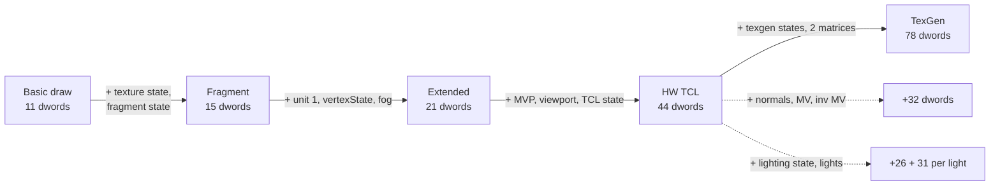
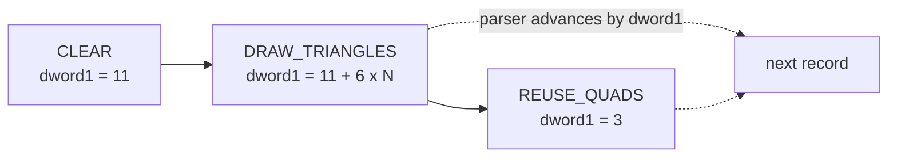
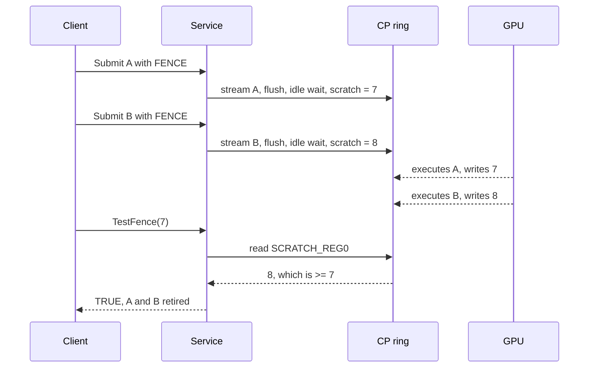

# 02 - Radeon3D service ABI reference

Canonical source: [`include/radeon3d.h`](../include/radeon3d.h) (public
structures and constants), [`include/radeon9200_chip.sfd`](../include/radeon9200_chip.sfd)
(function list), [`include/clib/radeon3d_protos.h`](../include/clib/radeon3d_protos.h),
[`include/inline/radeon3d_protos.h`](../include/inline/radeon3d_protos.h)
(68k GCC inline calls), and [`src/radeon3d_service.c`](../src/radeon3d_service.c)
(validation). When this document and the headers disagree, the headers win -
and this document is then wrong and must be fixed.

A consumer-side vendored copy exists at
`/home/mirek/minigl_ppc/third_party/radeon3d/include/`. It must be reconciled
with this tree before an ABI change is committed.

## 1. Library identity and opening

| Property | Value |
|---|---|
| Resident name | `Radeon9200.chip` |
| On-disk path (Picasso96) | `LIBS:Picasso96/Radeon9200.chip` |
| `lib_Version` / `lib_Revision` | 3 / 0 |
| Version string | `Radeon9200.chip 3.0 (2.9.2026)` |
| Node type / priority | `NT_LIBRARY` / -50 |
| Minimum CPU | `AFF_68020` (the library refuses to initialize on 68000) |
| Radeon3D library version | `RADEON3D_LIBRARY_VERSION` = 3 |
| Radeon3D interface version | `RADEON3D_IFACE_VERSION` = 19 |

Open by **resident name**, not by path. `OpenLibrary("Radeon9200.chip", 3)`
is what clients and `minigl.library` use; only Picasso96 loads the file from
`LIBS:Picasso96/` during monitor initialization. The DEBUG build keeps the
resident name `Radeon9200.chip` on purpose (see
[`05-build-deploy-run.md`](05-build-deploy-run.md#31-debug-builds)).

`Radeon9200Base` is the library base used by the inline macros; the caller
defines `struct Library *Radeon9200Base;` (or `#define RADEON3D_BASE_NAME`
before including `<inline/radeon3d.h>`).

## 2. LVO table

Negative offsets from the base in `A6`. `Size` fields must be set by the
caller before every structure-taking call.

| LVO | Function | Notes |
|---:|---|---|
| -30 | `InitChip` | Picasso96 entry; not a client API |
| -36 | `InitRadeonFeatures` | Picasso96 entry; not a client API |
| -42 | `Radeon3DOpen(ULONG requestedVersion, struct Radeon3DInfo *info)` | returns device handle or NULL |
| -48 | `Radeon3DClose(struct Radeon3DDevice *device)` | waits last fence up to 1 s |
| -54 | `Radeon3DGetInfo(struct Radeon3DDevice *device, struct Radeon3DInfo *info)` | refresh caps/counters/telemetry |
| -60 | `Radeon3DDetachOwner` | private, Prometheus/Picasso96 shutdown only |
| -66 | `Radeon3DSubmit(struct Radeon3DDevice *, const ULONG *commands, ULONG commandCount, ULONG flags, ULONG *fenceOut)` | interface-1 bounded packet path |
| -72 | `Radeon3DTestFence(struct Radeon3DDevice *, ULONG fence)` | non-blocking |
| -78 | `Radeon3DWaitFence(struct Radeon3DDevice *, ULONG fence, ULONG timeoutMs)` | 0 = one test; nonzero clamped to 60 s |
| -84 | `Radeon3DImportBitMap(struct Radeon3DDevice *, struct BitMap *, struct Radeon3DSurface *)` | P96 on-board bitmap |
| -90 | `Radeon3DReleaseSurface(struct Radeon3DDevice *, struct Radeon3DSurface *)` | void |
| -96 | `Radeon3DExecute(struct Radeon3DDevice *, const ULONG *records, ULONG recordDwords, ULONG flags, ULONG *fenceOut)` | interface 2+ |
| -102 | `Radeon3DInvalidateForTest(struct Radeon3DDevice *)` | DEBUG builds only; release returns FALSE |
| -108 | `Radeon3DAllocSegment(struct Radeon3DDevice *, ULONG bytes, struct Radeon3DSegment *)` | interface 13+ |
| -114 | `Radeon3DFreeSegment(struct Radeon3DDevice *, ULONG segmentId)` | interface 13+ |
| -120 | `Radeon3DCommitDraw(struct Radeon3DDevice *, const struct Radeon3DCommit *, ULONG *fenceOut)` | interface 13+ |
| -126 | `Radeon3DCommitBatch(struct Radeon3DDevice *, const struct Radeon3DCommitBatch *, ULONG *fenceOut)` | interface 13+ |
| -132 | `Radeon3DCommitStateBatch(struct Radeon3DDevice *, const struct Radeon3DStateBatch *, ULONG *fenceOut)` | interface 15+ |
| -138 | `Radeon3DAllocSurface(struct Radeon3DDevice *, ULONG width, ULONG height, ULONG format, struct Radeon3DSurface *)` | interface 17+ |
| -144 | `Radeon3DDispatchIndirect(struct Radeon3DDevice *, const struct Radeon3DIndirect *, ULONG *fenceOut)` | interface 18+ |
| -150 | `Radeon3DSubmitFence(struct Radeon3DDevice *, ULONG *fenceOut)` | interface 19+, parked |

`RADEON3D_SUBMIT_FENCE` (`1UL << 0`) is the only public submission flag for
`Execute`/`Submit`/commit calls. `RADEON3D_INDIRECT_NO_FENCE` (`1UL << 1`) is
the indirect-dispatch flag (parked).

## 3. Version negotiation

`Radeon3DOpen(requestedVersion, info)` grants
`min(requestedVersion, RADEON3D_IFACE_VERSION)` and writes it to
`info->Version`. Capabilities are cumulative by granted interface number, with
runtime gates:

| Granted interface | Capabilities added |
|---:|---|
| 1 | CP_READY, SINGLE_BOARD, OWNER_PINNED, PACKET2_SUBMIT, FENCES, BITMAP_IMPORT, IMMD_TRI_LIST |
| 2 | PHASE2_EXECUTE |
| 3 | DEPTH_FUNCS |
| 4 | TEXTURE_STATE |
| 5 | FOG_MULTITEX (+ TEST_INVALIDATE in DEBUG builds only) |
| 6 | COLOR_TARGET_FORMATS |
| 7 | NATIVE_TRI_PRIMITIVES |
| 8 | NATIVE_QUAD_LISTS |
| 9 | HW_TRANSFORM_CLIP |
| 10 | HW_TEXGEN |
| 11 | HW_NORMALS, HW_LIGHTING |
| 12 | HW_SPHERE_MAP, COMPACT_TCL_VERTEX |
| 13 | STREAM_SEGMENTS (if the segment pool exists) |
| 14 | COMMIT_STATE_REUSE |
| 15 | COMMIT_STATE_BATCH |
| 16 | ORDERED_COMMITS |
| 17 | AUX_SURFACES (if the aux pool exists) |
| 18 | INDIRECT_DISPATCH, INDIRECT_RENDER (if the segment pool exists), MULTI_FENCE |
| 19 | FENCE_COALESCE |

An interface-17 consumer keeps working against a 19 driver and simply never
sees bits 26-29. Conversely, a 19 consumer on an older driver receives a lower
`info.Version` and must not use newer vectors: the LVO physically exists only
if the driver exports it, so gate by capability, not by "the library version
looks new".

## 4. Capability bits

| Bit | Name | Meaning |
|---:|---|---|
| 0 | `CP_READY` | Command processor initialized and ring live |
| 1 | `SINGLE_BOARD` | One board instance per chip library load |
| 2 | `OWNER_PINNED` | Sessions pin `rtg.library` so `BoardInfo` cannot expire |
| 3 | `PACKET2_SUBMIT` | `Radeon3DSubmit` accepts PACKET2 no-op batches |
| 4 | `FENCES` | Fence tokens are returned and waitable |
| 5 | `BITMAP_IMPORT` | `Radeon3DImportBitMap` available |
| 6 | `IMMD_TRI_LIST` | Fixed immediate triangle-list stream accepted |
| 7 | `PHASE2_EXECUTE` | `Radeon3DExecute` semantic records |
| 8 | `DEPTH_FUNCS` | Eight depth comparisons in draw options |
| 9 | `TEXTURE_STATE` | 15-dword fragment-state draw header |
| 10 | `FOG_MULTITEX` | 21-dword extended header, unit 1, fog |
| 11 | `TEST_INVALIDATE` | Diagnostic recovery hook; DEBUG builds only |
| 12 | `COLOR_TARGET_FORMATS` | CLUT8 (RGB332) and B8G8R8A8 color targets |
| 13 | `NATIVE_TRI_PRIMITIVES` | Native strip/fan opcodes |
| 14 | `NATIVE_QUAD_LISTS` | Native quad-list opcode |
| 15 | `HW_TRANSFORM_CLIP` | Hardware TCL, 44-dword header, points/lines |
| 16 | `HW_TEXGEN` | Texgen block in TCL header |
| 17 | `HW_NORMALS` | Per-vertex normals + model-view matrices |
| 18 | `HW_LIGHTING` | Fixed-function lighting blocks |
| 19 | `HW_SPHERE_MAP` | Sphere-map texgen mode |
| 20 | `COMPACT_TCL_VERTEX` | TCL vertices omit unused unit-1/fog dwords |
| 21 | `STREAM_SEGMENTS` | Segment pool and commit calls |
| 22 | `COMMIT_STATE_REUSE` | Reuse records (3-dword state-reuse draws) |
| 23 | `COMMIT_STATE_BATCH` | `Radeon3DCommitStateBatch` |
| 24 | `ORDERED_COMMITS` | Commit streams share one in-order CP FIFO; latest fence retires earlier commits |
| 25 | `AUX_SURFACES` | `Radeon3DAllocSurface` and its reserved pool |
| 26 | `INDIRECT_DISPATCH` | `Radeon3DDispatchIndirect` (fetch/fence eligible) |
| 27 | `INDIRECT_RENDER` | Indirect path has render transitions/recovery |
| 28 | `MULTI_FENCE` | Any session fence in `(0, LastFence]` is testable/waitable |
| 29 | `FENCE_COALESCE` | Interface-19 no-fence dispatch + `SubmitFence` (parked) |

## 5. Info block

```c
struct Radeon3DInfo {
    ULONG Size;               /* in: caller's buffer size, out: tier filled */
    ULONG Version;            /* negotiated interface version */
    ULONG Generation;         /* service generation */
    ULONG DeviceId;           /* PCI device id, e.g. 0x5964 */
    ULONG Caps;               /* capability mask */
    ULONG InstalledVram;      /* bytes of VRAM on the board */
    ULONG Picasso96Vram;      /* bytes Picasso96 may allocate */
    ULONG MaxBatchDwords;     /* 8192 */
    /* V2 tail - cumulative Execute attribution, microseconds, all builds */
    ULONG ExecCalls;
    ULONG ExecRecordDwords;
    ULONG ExecGeneratedDwords;
    ULONG ExecCopyMicros;
    ULONG ExecBuildMicros;
    ULONG ExecSubmitMicros;
    /* V3 tail */
    ULONG CommitFailStage;    /* stage of the most recent failed commit, 0 = none */
    /* V4 tail - release-safe per-submission timing ring */
    APTR  SampleRing;         /* driver-owned RADEON3D_SAMPLE_RING_SIZE entries */
    ULONG SampleRingEntries;
    ULONG SampleSeq;
    ULONG EClockHz;
};
```

Size tiers: `RADEON3D_INFO_V1_SIZE` = 32,
`RADEON3D_INFO_V2_SIZE` = 56, `RADEON3D_INFO_V3_SIZE` = 60,
`RADEON3D_INFO_V4_SIZE` = 76. The driver fills only complete tiers that fit
the caller's buffer and reports the largest tier actually filled in `Size`;
a caller sitting between tiers keeps the lower one. `ExecCopy/Build/SubmitMicros`
are 64-bit-converted from EClock ticks once per phase boundary; the sample ring
keeps raw ticks and lets the reader convert with `EClockHz`.

### 5.1 Sample ring

`RADEON3D_SAMPLE_RING_SIZE` = 1024 entries. One sample is written at the end
of every submission call that reached the service, success or failure:

```c
struct Radeon3DSample {
    ULONG Seq;             /* global sequence number; written last */
    ULONG WallTicks;       /* EClock low word at completion */
    ULONG Type;            /* RADEON3D_SAMPLE_* */
    ULONG Result;          /* nonzero on success */
    ULONG RecordDwords;    /* host dwords the call received */
    ULONG GeneratedDwords; /* CP dwords it produced */
    ULONG CopyTicks;       /* staging copy (state batches; else 0) */
    ULONG BuildTicks;      /* validation + command build */
    ULONG SubmitTicks;     /* CP ring submit including fence work */
};
```

Types: `EXECUTE` 1, `COMMIT_DRAW` 2, `COMMIT_BATCH` 3, `STATE_BATCH` 4,
`SUBMIT` 5, `DISPATCH` 6. Entry `Seq` is cleared before the payload is
rewritten and published last, so a lock-free reader copies an entry only while
`Seq` matches and re-verifies after the copy. `radeon3dinfo` dumps the ring as
`R3DSAMPLE` lines; `tools/perfplot.py` groups them into frames.

## 6. Surfaces

```c
struct Radeon3DSurface {
    ULONG Size;         /* set by caller */
    ULONG Version;      /* out: RADEON3D_SURFACE_VERSION = 1 */
    ULONG Generation;   /* out: generation at import/alloc time */
    APTR  CpuAddress;   /* out: CPU mapping */
    ULONG GpuAddress;   /* out: GPU address */
    ULONG Pitch;        /* out: bytes per row (128-byte padded for aux) */
    ULONG Width;        /* out: width (padded for aux) */
    ULONG Height;       /* out */
    ULONG Format;       /* out: RADEON3D_FORMAT_* */
    APTR  Handle;       /* out: opaque handle for records */
};
```

Size: 40 bytes (`RADEON3D_SURFACE_V1_SIZE`).

Formats:

| Constant | Value | Bytes/pixel | Notes |
|---|---:|---:|---|
| `RADEON3D_FORMAT_R5G6B5PC` | 1 | 2 | little-endian 565; the primary color/depth format |
| `RADEON3D_FORMAT_B8G8R8A8` | 2 | 4 | B, G, R, X byte order; fourth byte unused by P96 |
| `RADEON3D_FORMAT_CLUT8` | 3 | 1 | direct RGB332 with hardware dithering as a color target |

Depth is always D16 stored in an R5G6B5PC-format surface. Imported bitmaps must
be P96 on-board allocations; planar or Fast-RAM bitmaps are rejected. Aux
surfaces are allocated from a 4 MiB private pool (`RADEON3D_AUX_POOL_BYTES`),
at most 8 live (`RADEON3D_MAX_AUX_SURFACES`), maximum dimension 4096
(`RADEON3D_AUX_MAX_DIMENSION`), pitch rounded up to 128 bytes.

## 7. Streaming segments

```c
struct Radeon3DSegment {
    ULONG Size;        /* in */
    ULONG Version;     /* out: 1 */
    ULONG Id;          /* out: 0..11 lease id */
    APTR  CpuAddress;  /* out: writable mapping */
    ULONG GpuAddress;  /* out: GPU base */
    ULONG Bytes;       /* out: granted bytes (as requested) */
};
```

Size: 24 bytes. `RADEON3D_MAX_SEGMENTS` = 12,
`RADEON3D_MAX_SEGMENT_BYTES` = 256 KiB, requested bytes must be nonzero,
4-byte aligned and within the maximum. Pool total 3 MiB. The client never
supplies a raw GPU address anywhere; records and dispatches reference segment
ids.

## 8. Commit structures

### 8.1 `Radeon3DCommit` (single draw)

```c
struct Radeon3DCommit {
    ULONG Size;                 /* RADEON3D_COMMIT_V1_SIZE = 28 */
    ULONG Version;              /* RADEON3D_COMMIT_VERSION = 1 */
    ULONG SegmentId;
    ULONG OffsetBytes;          /* 4-byte aligned; room for full vertex array */
    const ULONG *Header;        /* one header-only draw record */
    ULONG HeaderDwords;
    ULONG Flags;                /* RADEON3D_SUBMIT_FENCE */
};
```

### 8.2 `Radeon3DCommitBatch` (chain)

```c
struct Radeon3DCommitBatch {
    ULONG Size;                 /* 32 */
    ULONG Version;              /* 1 */
    ULONG SegmentId;
    const ULONG *Records;       /* chain linked by dword[1] lengths */
    ULONG RecordDwords;
    const ULONG *VertexOffsets; /* one byte offset per draw record, in order */
    ULONG RecordCount;
    ULONG Flags;
};
```

Every record must be a hardware-TCL draw, a reuse draw, or a clear; a clear
consumes no vertex offset, and any other record type is rejected.
`RecordCount` must equal the number of draw/reuse records found. One ring
submit, one fence.

### 8.3 `Radeon3DStateBatch` (homogeneous draws)

```c
struct Radeon3DStateBatchDraw {
    ULONG OffsetBytes;
    ULONG VertexCount;
};                              /* 8 bytes */

struct Radeon3DStateBatch {
    ULONG Size;                 /* 40 */
    ULONG Version;              /* 1 */
    ULONG Generation;           /* must equal the live service generation */
    ULONG SegmentId;
    ULONG Primitive;            /* one RADEON3D_EXEC_DRAW_* opcode */
    const ULONG *Header;        /* one complete hardware-TCL draw header */
    ULONG HeaderDwords;
    const struct Radeon3DStateBatchDraw *Draws;
    ULONG DrawCount;            /* <= RADEON3D_STATE_BATCH_MAX_DRAWS = 192 */
    ULONG Flags;
};
```

The header's vertex count is replaced per descriptor. The service copies the
header and descriptor array once before parsing.

## 9. Indirect dispatch

```c
struct Radeon3DIndirect {
    ULONG Size;         /* 24 */
    ULONG Version;      /* 1 */
    ULONG SegmentId;
    ULONG ByteOffset;   /* 16-byte aligned */
    ULONG DwordCount;   /* nonzero, even, <= 8192 */
    ULONG Flags;        /* 0 or RADEON3D_INDIRECT_NO_FENCE (parked) */
};
```

Validated: session interface >= 18 (and >= 19 for `NO_FENCE`), live segment
lease, `ByteOffset + DwordCount*4` within the lease, GPU-address overflow
guard, descriptor snapshotted before `RadeonPrepare3D()` so a caller mutation
during prepare cannot change the submitted address or count.

Failure stages (also written into `CommitFailStage`):

| Stage | Meaning |
|---:|---|
| 100/101 | descriptor/flag/count/alignment rejection before locking |
| 102 | session unusable at lock |
| 103 | interface < 18/19, no pool, or bad segment id |
| 104/105 | range or GPU-address overflow |
| 106 | submission failed |
| 107 | `RadeonPrepare3D` failed |
| 108 | stale state after prepare (generation/board/lease changed) |
| 110-116 | `Radeon3DSubmitFence` equivalents |

## 10. Semantic record formats

Every record begins with `{opcode, length}` where `length` counts all dwords
including the two-dword header. Parsing must end exactly at the supplied dword
count. All dwords are host-endian.

Draw headers grow in interface-gated steps; each step keeps the previous
layout intact:



### 10.1 Opcodes

| Opcode | Value | Minimum interface | Header dwords |
|---|---:|---:|---:|
| `RADEON3D_EXEC_CLEAR` | 1 | 2 | 11 |
| `RADEON3D_EXEC_DRAW_TRIANGLES` | 2 | 2 | 11 / 15 / 21 / 44 / 78 + blocks |
| `RADEON3D_EXEC_DRAW_TRI_STRIP` | 3 | 7 | as triangles |
| `RADEON3D_EXEC_DRAW_TRI_FAN` | 4 | 7 | as triangles |
| `RADEON3D_EXEC_DRAW_QUADS` | 5 | 8 | as triangles |
| `RADEON3D_EXEC_DRAW_POINTS` | 6 | 9 | as triangles (HW TCL) |
| `RADEON3D_EXEC_DRAW_LINES` | 7 | 9 | as triangles (HW TCL) |
| `RADEON3D_EXEC_DRAW_LINE_STRIP` | 8 | 9 | as triangles (HW TCL) |
| `RADEON3D_EXEC_DRAW_LINE_LOOP` | 9 | 9 | as triangles (HW TCL) |
| `RADEON3D_EXEC_REUSE_TRIANGLES` | 10 | 14 | 3 |
| `RADEON3D_EXEC_REUSE_TRI_STRIP` | 11 | 14 | 3 |
| `RADEON3D_EXEC_REUSE_TRI_FAN` | 12 | 14 | 3 |
| `RADEON3D_EXEC_REUSE_QUADS` | 13 | 14 | 3 |
| `RADEON3D_EXEC_REUSE_POINTS` | 14 | 14 | 3 |
| `RADEON3D_EXEC_REUSE_LINES` | 15 | 14 | 3 |
| `RADEON3D_EXEC_REUSE_LINE_STRIP` | 16 | 14 | 3 |
| `RADEON3D_EXEC_REUSE_LINE_LOOP` | 17 | 14 | 3 |

A **reuse record** is `{opcode, 3, vertexCount}`. It consumes one vertex offset
from the commit batch's offset table and re-draws with the previous record's
complete emitted state. It is a commit-stream feature; do not send it to
`Radeon3DExecute`.

A call is a chain of records; the parser advances by each record's `dword[1]`
length and must land exactly on the supplied dword count:



### 10.2 Clear record (11 dwords)

```text
opcode, 11
color target handle
depth target handle or 0
RADEON3D_CLEAR_COLOR | RADEON3D_CLEAR_DEPTH
packed clear RGBA (format-dependent conversion)
IEEE-754 depth in [0,1]
left, top, right-exclusive, bottom-exclusive
```

A depth clear requires a distinct, non-overlapping D16 surface with the same
dimensions. A color-only clear requires a zero depth handle. The scissor must
be nonempty and contained by the target. Color format/pitch come from the
imported surface; CLUT8 uses hardware dithering to RGB332.

### 10.3 Draw header, basic (11 dwords)

```text
opcode, length
color target handle
depth target handle or 0
texture handle or 0
options
left, top, right-exclusive, bottom-exclusive
vertexCount
```

### 10.4 Draw options

| Bit | Name |
|---:|---|
| 0 | `RADEON3D_DRAW_TEXTURED` |
| 1 | `RADEON3D_DRAW_BILINEAR` |
| 2 | `RADEON3D_DRAW_ALPHA_BLEND` (source alpha / one-minus-source alpha) |
| 3 | `RADEON3D_DRAW_DEPTH_LESS` |
| 4 | `RADEON3D_DRAW_DEPTH_WRITE` |
| 5-7 | depth comparison, `RADEON3D_DRAW_DEPTH_FUNC(value)` (interface 3+) |
| 8 | `RADEON3D_DRAW_FRAGMENT_STATE` |
| 9 | `RADEON3D_DRAW_EXTENDED_VERTEX` |
| 10 | `RADEON3D_DRAW_HW_TCL` |
| 11 | `RADEON3D_DRAW_TEXGEN` |
| 12 | `RADEON3D_DRAW_NORMALS` |
| 13 | `RADEON3D_DRAW_LIGHTING` (implies NORMALS) |
| 14 | `RADEON3D_DRAW_COMPACT_VERTEX` |

Depth comparisons: `LESS` 0, `LEQUAL` 1, `EQUAL` 2, `GEQUAL` 3, `GREATER` 4,
`NOTEQUAL` 5, `NEVER` 6, `ALWAYS` 7. Zero means `LESS`, so interface-2 records
keep their exact behavior. Mask constants:
`RADEON3D_DRAW_OPTIONS_BASIC` = 0xff, `..._FRAGMENT` = 0x1ff,
`..._PRE_TCL` = 0x3ff, `RADEON3D_DRAW_OPTIONS` = 0x7fff. Unknown bits are
rejected.

### 10.5 Vertices

| Variant | Dwords | Layout |
|---|---:|---|
| basic | 6 | X, Y, Z, S0, T0, packedColor |
| extended (interface 5+) | 9 | X, Y, Z, S0, T0, packedColor, S1, T1, fog or W |
| HW TCL (interface 9+) | 10 | X, Y, Z, W, packedARGBColor, S0, T0, S1, T1, fog |
| HW TCL + normals (interface 11+) | 13 | X, Y, Z, W, NX, NY, NZ, packedARGBColor, S0, T0, S1, T1, fog |
| compact TCL (interface 12+) | 10 / 7 | same order with S1, T1, fog omitted (10 with normals, 7 without) |

- Basic/extended coordinates are screen-space; HW TCL coordinates are
  object-space and transformed by the submitted matrix.
- `packedColor` / `packedARGBColor` is `(alpha<<24)|(red<<16)|(green<<8)|blue`
  for both paths.
- X/Y must be finite, non-negative and within the color target for
  screen-space draws. Z/S/T are finite in `[0,1]`.
- Extended dword 8 is `fogAmount` in `[0,1]` or, with
  `RADEON3D_VERTEX_CLIP_COORDINATES`, a finite positive homogeneous W in
  `(0, 65536]`. Fog and perspective are mutually exclusive.
- `vertexCount` is 3..255 and a multiple of three for triangle lists;
  strip/fan accept any 3..255; quads are a multiple of four, from 4 to 252 for
  inline records (the limit keeps both the public and generated streams within
  `MaxBatchDwords`), with R200/Mesa order `(0,1,3)` and `(1,2,3)`. Streaming
  commit records have no fixed 252 cap: the vertex array only has to fit the
  segment lease.

### 10.6 Fragment-state header (15 dwords, interface 4+)

Extends the basic header with four dwords before the vertex array:

```text
... vertexCount,
texture byte offset,
packed (width - 1) | ((height - 1) << 16),
textureState,
fragmentState
```

`textureState` (`RADEON3D_TEX_STATE_MASK` = 0x00000f7f):

| Bits | Meaning |
|---:|---|
| 0 | `RADEON3D_TEX_MODULATE` (else replace) |
| 1 | `RADEON3D_TEX_REPEAT_S` |
| 2 | `RADEON3D_TEX_REPEAT_T` |
| 3 | `RADEON3D_TEX_MAG_LINEAR` (else nearest) |
| 4-6 | minification filter, 0..5 semantic values |
| 8-11 | packed POT mip level count, 1..12 |
| 16-31 | texture content serial (`RADEON3D_TEX_CONTENT_*`), forces re-emission of texture unit state |

Minification values: `NEAREST` 0, `LINEAR` 1, `NEAREST_MIPMAP_NEAREST` 2,
`LINEAR_MIPMAP_NEAREST` 3, `NEAREST_MIPMAP_LINEAR` 4,
`LINEAR_MIPMAP_LINEAR` 5 (the last two map to raw R200 filter encodings 6/7,
as in Mesa's `r200SetTexFilter`). Mip trees use consecutive 32-byte-aligned
rows and must fit inside the imported backing surface.

`fragmentState` (`RADEON3D_FRAGMENT_STATE_MASK` = 0x01ffffff):

| Bits | Meaning |
|---:|---|
| 0 | `RADEON3D_FRAGMENT_ALPHA_TEST` |
| 1-3 | alpha function (`RADEON3D_FRAGMENT_ALPHA_FUNC_*`) |
| 8-15 | alpha reference |
| 16 | `RADEON3D_FRAGMENT_BLEND` |
| 17-20 | source blend factor (`RADEON3D_BLEND_*`) |
| 21-24 | destination blend factor |

Blend factors: `ZERO` 0, `ONE` 1, `SRC_COLOR` 2, `ONE_MINUS_SRC_COLOR` 3,
`DST_COLOR` 4, `ONE_MINUS_DST_COLOR` 5, `SRC_ALPHA` 6,
`ONE_MINUS_SRC_ALPHA` 7, `DST_ALPHA` 8, `ONE_MINUS_DST_ALPHA` 9,
`SRC_ALPHA_SATURATE` 10.

### 10.7 Extended header (21 dwords, interface 5+)

Requires `FRAGMENT_STATE | EXTENDED_VERTEX`; extended vertices without
fragment state are invalid.

```text
... fragmentState,
texture 1 handle or 0,
texture 1 byte offset,
texture 1 packed (width - 1) | ((height - 1) << 16),
texture1State,
vertexState,
fog color in low 24-bit RGB
```

`vertexState` (`RADEON3D_VERTEX_STATE_MASK` = 0x7): `VERTEX_FOG` bit 0,
`VERTEX_TEXTURE1` bit 1, `VERTEX_CLIP_COORDINATES` bit 2 (interface 8+).
Inactive texture-1 fields and S1/T1 must be zero; inactive fog color and every
inactive final vertex dword must be zero. Texture 1 uses the same sampler and
backing rules as unit 0 and must not overlap color/depth; the same surface may
be sampled by both units.

### 10.8 Hardware-TCL header (44 dwords, interface 9+)

```text
header dwords 0..20: extended header
dwords 21..36: OpenGL column-major model-projection matrix (16)
dwords 37..42: viewport X/Y/Z scale and offset pairs (6)
dword 43:      RADEON3D_TRANSFORM_* state
```

Transform state (`RADEON3D_TRANSFORM_STATE_MASK` = 0x000fff3f):
`CULL_FRONT` bit 0, `CULL_BACK` bit 1, `FRONT_CCW` bit 2,
`FLAT_SHADE` bit 3, `POLYGON_LINE` bit 4, `POLYGON_POINT` bit 5,
point size in bits 8-19. The front-face convention is OpenGL's pre-viewport
convention; the driver owns the hardware Y inversion.

### 10.9 Texgen block (interface 10+)

Adds two state dwords and 32 matrix dwords after the TCL block:

```text
dword 44: unit 0 texgen state
dword 45: unit 1 texgen state
dwords 46..61: unit 0 OpenGL column-major matrix
dwords 62..77: unit 1 OpenGL column-major matrix
```

`RADEON3D_TEXGEN_STATE_MASK` = 0x000000ff: mode in bits 0-3
(`OFF` 0, `OBJECT_LINEAR` 1, `SPHERE_MAP` 2), generation enables in bits 4-7
(`GEN_S`, `GEN_T`, `GEN_R`, `GEN_Q`). Each enabled unit needs a bound texture
and must generate S and T. Object-linear mode uses plane matrices; sphere-map
mode (interface 12+) uses the OpenGL texture matrix and requires normals and
exactly the S/T generation bits. An inactive unit's state and all 16 matrix
dwords must be zero.

### 10.10 Normals block (interface 11+)

After the TCL (and optional texgen) block, 32 dwords:

```text
dwords: model-view matrix (OpenGL column-major, 16)
dwords: inverse model-view matrix (OpenGL column-major, 16)
```

### 10.11 Lighting block (interface 11+)

After the normals block:

```text
4 dwords:  global ambient RGBA
4 dwords:  eye vector (eye-space view direction XYZ, normal rescale factor)
1 dword:   light control
17 dwords: front material (emissive, ambient, diffuse, specular, shininess)
per enabled light, ascending: one dense 31-dword block
```

`lightControl`: bits 0-7 enabled-light mask (one dense block per set bit, in
ascending order), bit 8 local-viewer specular model, bits 16-23 spotlight
lights, bits 24-31 range attenuation. Bits 9-15 must be zero
(`RADEON3D_LIGHT_CONTROL_RESERVED` = 0x0000fe00).

Light block: 24 vector dwords (ambient RGBA, diffuse RGBA, specular RGBA,
eye-space position XYZW, negated normalized spot direction XYZW,
quadratic/linear/constant attenuation, reserved) then 7 scalar dwords (spot
DCD, DCM, exponent, cos(cutoff), specular threshold, squared range cutoff,
1/constant-attenuation or +inf). All values are IEEE-754.

Material block: emissive, ambient, diffuse, specular RGBA then shininess
(`RADEON3D_MATERIAL_DWORDS` = 17).

### 10.12 Size constants

| Constant | Value |
|---|---:|
| `RADEON3D_EXEC_CLEAR_DWORDS` | 11 |
| `RADEON3D_EXEC_DRAW_HEADER_DWORDS` | 11 |
| `RADEON3D_EXEC_DRAW_FRAGMENT_HEADER_DWORDS` | 15 |
| `RADEON3D_EXEC_DRAW_EXTENDED_HEADER_DWORDS` | 21 |
| `RADEON3D_EXEC_DRAW_HW_TCL_HEADER_DWORDS` | 44 |
| `RADEON3D_EXEC_DRAW_TEXGEN_HEADER_DWORDS` | 78 |
| `RADEON3D_EXEC_NORMAL_MATRICES_DWORDS` | 32 |
| `RADEON3D_EXEC_LIGHT_STATE_DWORDS` | 26 |
| `RADEON3D_EXEC_LIGHT_BLOCK_DWORDS` | 31 |
| `RADEON3D_EXEC_MAX_LIGHT_BLOCKS` | 8 |
| `RADEON3D_EXEC_VERTEX_DWORDS` | 6 |
| `RADEON3D_EXEC_EXTENDED_VERTEX_DWORDS` | 9 |
| `RADEON3D_EXEC_HW_TCL_VERTEX_DWORDS` | 10 |
| `RADEON3D_EXEC_HW_TCL_NORMAL_VERTEX_DWORDS` | 13 |

## 11. Legacy immediate triangle list

`Radeon3DSubmit()` accepts either all-`PACKET2` batches or exactly this stream:
22 single-register `PACKET0` writes followed by one `3D_DRAW_IMMD_2` packet.
All dwords host-endian; the service performs PCI byte swapping. Target: a live
imported 16-byte-aligned R5G6B5PC bitmap whose dimensions/pitch match the
register values.

```text
SE_VAP_CNTL_STATUS   0
SE_VAP_CNTL          FORCE_W_TO_ONE | (9 << VF_MAX_VTX_NUM_SHIFT)
SE_VTX_STATE_CNTL    0
SE_VTE_CNTL          0
SE_VTX_FMT_0         packed RGBA color 0
SE_VTX_FMT_1         0
SE_CNTL              solid front/back, diffuse Gouraud, OGL pixel center,
                     1/4 rounding (0x9800021e)
PP_CNTL              texture blend stage 0 enabled
PP_TXCBLEND_0        diffuse color
PP_TXCBLEND2_0       clamp 0..1, output R0
PP_TXABLEND_0        diffuse alpha
PP_TXABLEND2_0       clamp 0..1, output R0
PP_CNTL_X            0
RE_AUX_SCISSOR_CNTL  0
RE_CNTL              0
RE_TOP_LEFT          0
RE_WIDTH_HEIGHT      ((height-1) << 16) | (width-1)
RB3D_PLANEMASK       0xffffffff
RB3D_BLENDCNTL       source ONE, destination ZERO
RB3D_CNTL            RGB565
RB3D_COLOROFFSET     imported surface GPU address
RB3D_COLORPITCH      imported surface pitch / 2
```

Final packet:

```text
PACKET3(3D_DRAW_IMMD_2, vertexCount * 3)
(vertexCount << 16) | PRIM_WALK_RING | TRI_LIST
per vertex: IEEE-754 X, IEEE-754 Y, packed RGBA
```

`vertexCount` is a positive multiple of three from 3 through
`RADEON3D_IMMD_MAX_VERTICES` (255). X/Y are non-negative finite values within
the target. Anything else is rejected before the ring write pointer changes.

## 12. Fence and error semantics

- A successful submission with `RADEON3D_SUBMIT_FENCE` writes a nonzero fence
  token to `fenceOut`. `Radeon3DSubmit` always creates an internal fence; it
  reports it only when the flag is set.
- Every fenced submission appends a 6-dword cache flush plus a full GPU idle
  wait. On the reference machine that drain costs milliseconds, which is why
  the service is built around large batches and one wait per buffer rotation
  rather than one wait per draw (measured costs in
  [`04-performance.md`](04-performance.md#2-cycle-cost-table)).
- Fence range validation: with `MULTI_FENCE`, any fence in the live submitted
  range `(0, LastFence]` is testable/waitable; without it, only `LastFence`.
  Monotonic wrap is handled (`CpFenceReached`).
- `Radeon3DWaitFence(dev, fence, 0)` is one non-blocking test.
- Failed calls write `0x80000000 | stage` to `fenceOut` where the call
  produced one. Commit stages additionally encode a group in bits 16-30
  (`0x80000000 | (group << 16) | stage`). The same value appears in
  `info.CommitFailStage` (without the group) for the most recent commit
  failure.
- `Radeon3DTestFence` also invalidates the host read buffer so a following CPU
  read sees GPU writes.

Fences are ring-ordered: a retiring later fence proves every earlier
submission completed, so one wait can retire a whole frame's submissions.



Commit failure stages:

| Stage | Group | Meaning |
|---:|---|---|
| 1 | commit | null/oversized/flag rejection |
| 2 | commit | interface < 13 or working buffers unavailable |
| 3 | commit | malformed record chain |
| 4 | commit | non-draw/non-clear record in a commit stream |
| 5 | commit | walk/count mismatch |
| 6/7 | commit | emitter build or prepare failure |
| 8 | commit | submission failure |
| 40-44 | batch | wrapper validation, segment, offsets |
| 80-86 | state batch | wrapper validation, copy, descriptors, emitter, submit |
| 100-108 | indirect | descriptor, session, segment, range, prepare, stale |
| 110-116 | submit-fence | same pattern for `Radeon3DSubmitFence` |

## 13. Limits summary

| Limit | Value |
|---|---:|
| Max batch dwords per call | 8192 |
| Immediate vertices (legacy) | 255 |
| Quad vertices (inline, basic/fragment/extended) | 252 |
| Quad vertices (inline, HW TCL) | 252 |
| Quad vertices (streaming commit) | bounded by the segment lease only |
| State-batch draws | 192 |
| Segments | 12 x 256 KiB |
| Aux surfaces | 8, 4 MiB pool, 4096 max dimension |
| Textures | 2048x2048, RGB565 or B8G8R8A8 |
| Fence wait clamp | 60 s |
| Sample ring | 1024 entries |
| Max lights | 8 |
| Texture units | 2 |

## 14. ABI layout rules

- Public structures use only fixed-width AmigaOS types and the normal m68k
  two-byte alignment.
- Every structure has a compile-time size assertion in `radeon3d.h`; keep
  them when editing.
- `Size` is the first field of every structure and is set by the caller before
  the call. The driver reads only fields that fit the declared size tier and
  rejects undersized structures.
- Field order of `struct Radeon3DEmitState` in
  [`include/radeon3d_emit.h`](../include/radeon3d_emit.h) is load-bearing for the
  capture-zeroing contract; read the comment there before moving members.
- The emitter (`src/radeon3d_emit.c`) is deliberately dual-target: it has no
  ExecBase, locking or I/O, so the same source can run on the 68k service and
  in a PPC frontend. Do not add platform dependencies to it.
