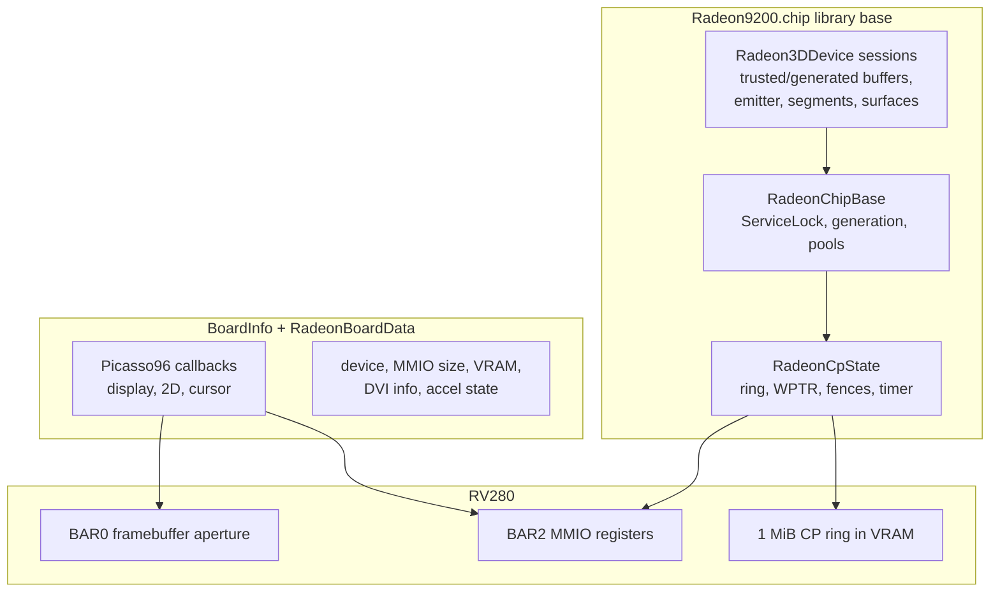
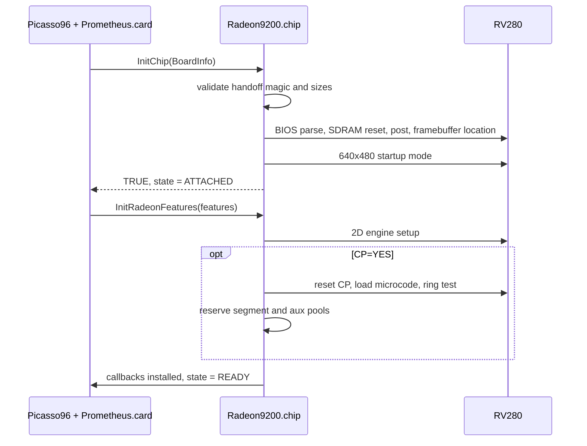
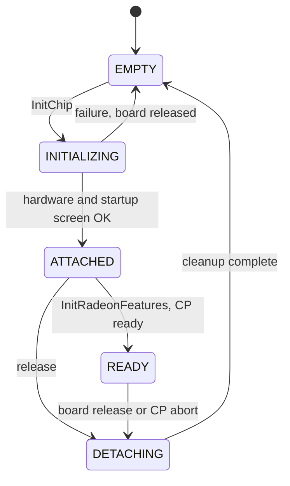
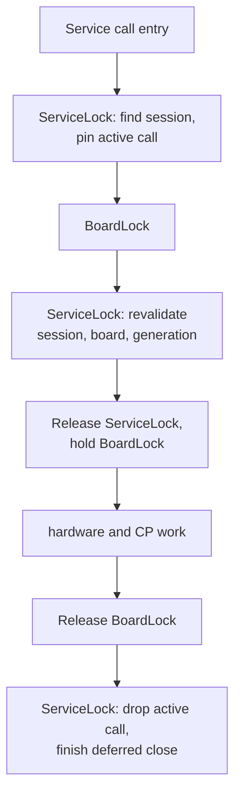
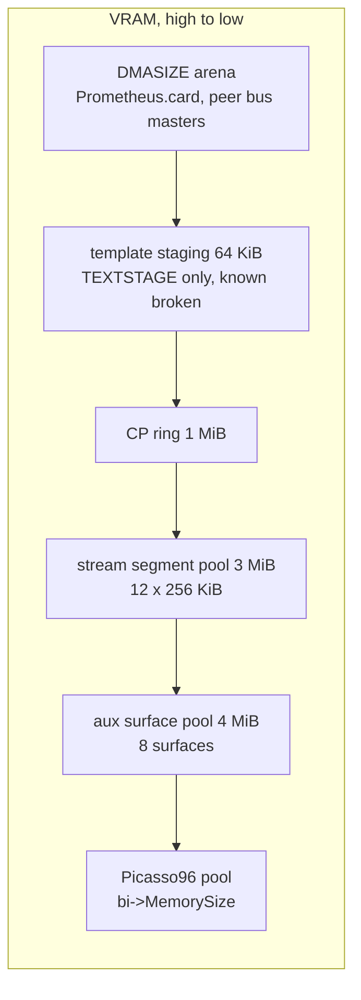
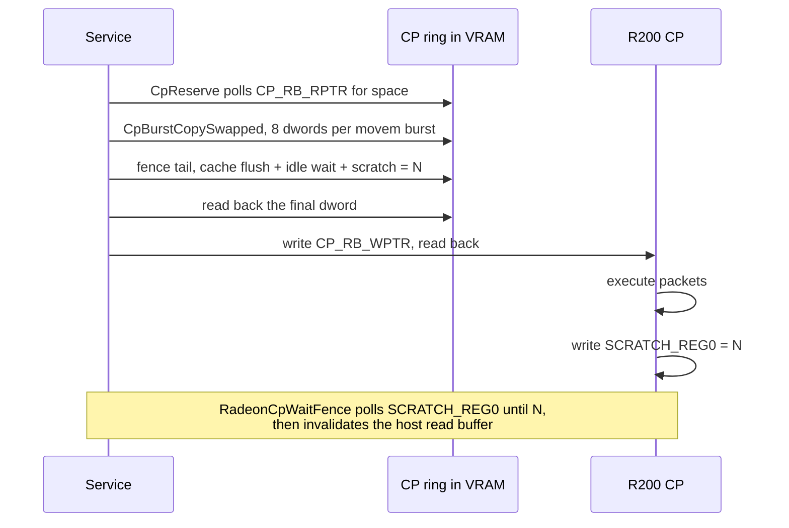
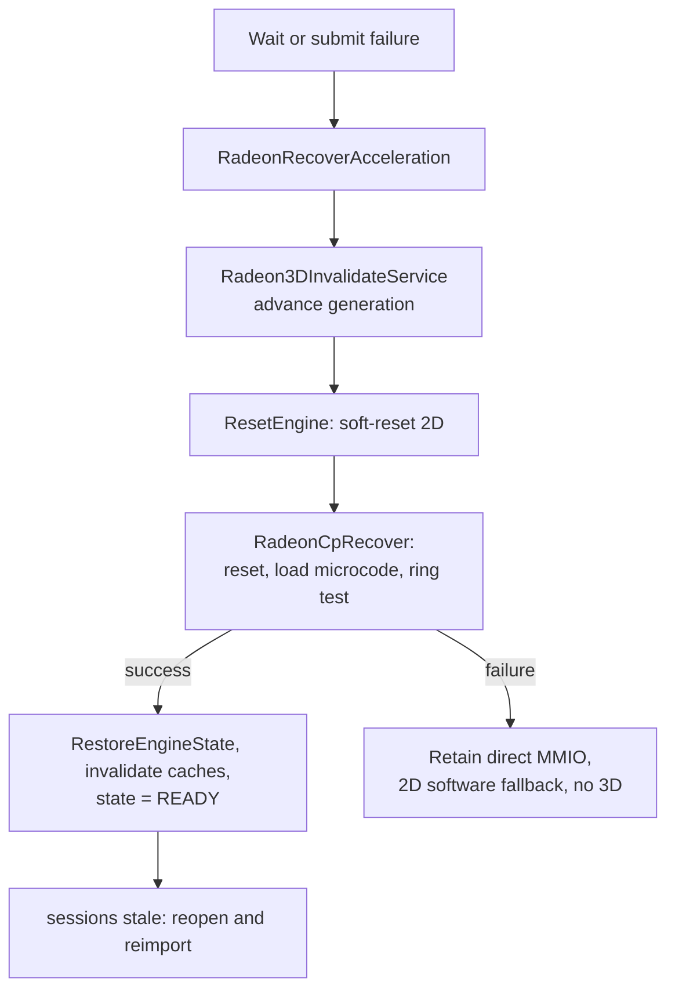
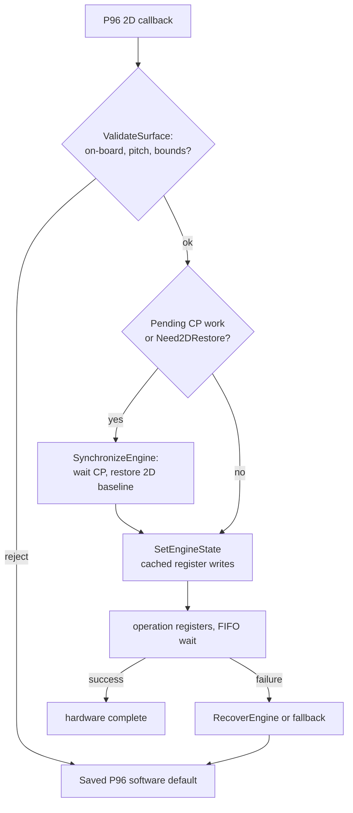

# 03 - Driver architecture

This is the 68k-side internals reference. It assumes you have read the client
view ([`01-ppc-client-guide.md`](01-ppc-client-guide.md)) and the ABI
([`02-service-abi-reference.md`](02-service-abi-reference.md)).



## 1. Source map

| File | Role |
|---|---|
| `src/startup.c` | `_start` stub; keeps the first code hunk valid for a library |
| `src/library.c` | resident/ROMTag, function table, open/close/expunge |
| `src/radeon9200.c` | `InitChip`/`InitRadeonFeatures`, MMIO accessors, board release |
| `src/radeon9200.h` | board/base structures, service states, all internal prototypes |
| `src/radeon_regs.h` | R200 register, packet and bit definitions |
| `src/radeon_bios.c` | legacy COMBIOS parsing, PLL/SDRAM/init tables, posting |
| `src/radeon_mode.c` | Picasso96 display callbacks: CRTC, PLL, palette, panning, DPMS |
| `src/radeon_cursor.c` | 64x64 ARGB hardware cursor, software fallback |
| `src/radeon_accel.c` | 2D engine callbacks, engine-state cache, fallbacks, 3D/2D arbitration |
| `src/radeon_cp.c` | command processor: ring, microcode, fences, waits, recovery |
| `src/r200_microcode.c` | R200 CP microcode image (licensed; see `R200_MICROCODE_LICENSE.txt`) |
| `src/radeon3d_emit.c` | dual-target R200 command emitter (semantic records -> CP dwords) |
| `include/radeon3d_emit.h` | emitter structures and capture-zone contract |
| `src/radeon3d_service.c` | Radeon3D service: sessions, surfaces, commits, indirect, telemetry |
| `src/radeon_debug.c/.h` | DEBUG-only passive stats port and probes |
| `src/dma.c` | private VRAM carve/free helpers |
| `src/runtime_shim.c` | freestanding `memcpy`/`memset` |
| `include/` | public Radeon3D headers, prototypes, SFD, Prometheus handoff |
| `tools/` | 68k probes/benchmarks and host-side Python tests |
| `Prometheus/PrometheusCard` | submodule: `Prometheus.card` sources (PCI, claim, DMA arena) |

Build and link order matters: `src/startup.c` and `src/library.c` are first in
`SOURCES`, so `_start` and the resident data stay in the first code hunk. Keep
that order.

## 2. Library lifecycle

```
OpenLibrary("Radeon9200.chip")
    LibInit:   reject < 68020; init lib fields, semaphore, device lists,
               generation = 1, next handle = 0x80000000, state = EMPTY
    LibOpen:   first open -> OpenLibrary("prometheus.library", 2)
    ...        (Picasso96 has already loaded the file and called InitChip)
CloseLibrary()
    LibClose:  open count 0 and no sessions -> RadeonReleaseBoard();
               close prometheus.library; expunge if LIBF_DELEXP
```

`InitChip(bi)` is called by Picasso96 with the `BoardInfo` from
`Prometheus.card`:

1. Validate the Prometheus handoff (`PROM_RADEON_HANDOFF_MAGIC` = `0x50524d52`)
   copied out of `BoardInfo.CardData`: board pointer, `MemoryBase`,
   `MemoryIOBase`, framebuffer >= 4 MiB, MMIO >= 64 KiB.
2. Move `EMPTY -> INITIALIZING`; record device id, output selection (VGA/DVI),
   MMIO size; set `GraphicsControllerType = GCT_Radeon`,
   `PaletteChipType = PCT_Radeon`, `MemorySize = FramebufferSize`.
3. `RadeonInitializeHardware(bi)`: BIOS load/parse, SDRAM reset, card posting,
   framebuffer location, PLL/clock info.
4. `RadeonShowStartupScreen(bi)`: 640x480 startup mode.
5. `INITIALIZING -> ATTACHED`.

`InitRadeonFeatures(bi, features)` then runs:

1. `RadeonInitializeAcceleration(bi, CP?, TEXTSTAGE?)`: 2D engine, optional CP,
   optional template staging, private VRAM pools.
2. `RDEBUG_OPEN` publishes the DEBUG stats port.
3. `RadeonInstallCallbacks`: display/2D/cursor callbacks (only those safe for
   the advertised formats).
4. If the CP is ready: `Radeon3DAdvanceGeneration()` and
   `ATTACHED -> READY`. Radeon3D sessions can only open in `READY`.



`BoardInfo.ChipData` holds `struct RadeonBoardData` (per-board state);
`BoardInfo.ChipBase` points at the chip library base. Callbacks are entered
**without the chip library base guaranteed in A6** - all callback code must be
base-independent.

`RadeonReleaseBoard()` runs on close, detach or fatal init failure. It takes
`BoardInfo.BoardLock` then `ServiceLock`, moves the service to `DETACHING`,
clears `BoardInfo`, advances the generation, and then blanks output, shuts
down the cursor and acceleration, and clears the board data.

## 3. Service state machine, sessions and locks

States (`RADEON3D_SERVICE_*`):

| State | Meaning |
|---|---|
| `EMPTY` | no board attached |
| `INITIALIZING` | `InitChip` running |
| `ATTACHED` | board initialized, features not yet installed |
| `READY` | CP live; sessions may open |
| `DETACHING` | board going away; no new work |



Each open session (`struct Radeon3DDevice`) records:

- magic `0x52334453` ("R3DS"), session generation, granted interface version,
- base pointer, owner pin (`rtg.library` open reference), opaque handle,
- active-call count, `LastFence`, closing/cleanup flags,
- `ExecuteTrusted` and `ExecuteGenerated` (8192 dwords each),
- `ExecuteEmitter` (session-owned, ~1.6 KiB + captures),
- 12 segment slots, and a `MinList` of surface handles.

Generation rules:

- `Radeon3DAdvanceGeneration()` increments on board detach and CP abort.
- `IsUsableDevice()` requires: magic intact, same base, session generation ==
  service generation, state `READY`, board attached, CP ready.
- A stale handle fails validation before any dereference, so a closed session
  or a recovered service cannot be used by accident.

Lock rules (invariant, keep them):

1. When both are needed, take `BoardInfo.BoardLock` **before**
   `RadeonChipBase.ServiceLock`.
2. `LockServiceBoard()` does: `ServiceLock` (find + pin active call) -> release
   -> `BoardLock` -> `ServiceLock` (re-validate) -> release `ServiceLock`,
   returning with `BoardLock` held and the active-call count incremented.
3. `UnlockServiceBoard()` releases `BoardLock` first, then decrements the
   active-call count under `ServiceLock` and may finish a deferred close.
4. Metadata paths (`GetInfo`, `TestFence` validation) take only `ServiceLock`.
5. A session closed while a call is active is retired: it is moved to the
   retired list, `Closing` is set, and cleanup happens when the last active
   call finishes. `ReapRetiredDevicesLocked()` frees retired devices.



The owner pin: every session opens `rtg.library` and reports
`RADEON3D_CAP_OWNER_PINNED`. If the final owner pin closes while `rtg.library`
has a delayed expunge pending, the service detaches Radeon while `BoardInfo` is
still valid, then releases the pin. Clients must keep their chip-library
reference until after `Radeon3DClose()` returns.

## 4. Working memory

Private 68k working buffers use `AllocExecuteMemory()`:

```c
memory = AllocMem(bytes, MEMF_LOCAL);
if (memory && !(TypeOfMem(memory) & MEMF_FAST)) { FreeMem(...); memory = NULL; }
return memory ? memory : AllocMem(bytes, MEMF_PUBLIC);
```

The reason: the WarpOS/Sonnet task allocator hook redirects `PUBLIC` or `FAST`
requests to PPC RAM even when `LOCAL` is set. A 68k task then pays PCI-memory
latency for every access. Requesting only `MEMF_LOCAL` avoids the hook, and the
`TypeOfMem` FAST check rejects Chip RAM. If local Fast RAM is unavailable, the
plain public allocation is the fallback. This policy applies to
`ExecuteGenerated`, `ExecuteEmitter` and `ExecuteTrusted`; the measured effect
is in [`04-performance.md`](04-performance.md#7-ppc-memory-placement).

Sizes:

| Buffer | Size | Notes |
|---|---:|---|
| `ExecuteGenerated` | 8192 dwords = 32 KiB | CP stream built by the emitter |
| `ExecuteTrusted` | 8192 dwords = 32 KiB | state-batch staging snapshot |
| `ExecuteEmitter` | ~1.6 KiB + 2 captures | session-owned, too large for a stack |
| sample ring | 1024 x 36 B = 36 KiB | allocated with the timer on first session |
| CP ring | 1 MiB | private VRAM |

## 5. Private VRAM layout

All private allocations are carved from the top of `bi->MemorySize` by
`RadeonAllocatePrivateVram()`/`RadeonFreePrivateVram()` (page-aligned,
LIFO release: only the most recent carve can be freed). Picasso96 never sees
this memory. Order of creation:

| Order | Region | Size | Created by |
|---:|---|---:|---|
| 1 | template staging (only `TEXTSTAGE=YES`) | 64 KiB | `RadeonInitializeAcceleration` |
| 2 | CP ring | 1 MiB | `RadeonCpInitialize` |
| 3 | streaming segment pool | 12 x 256 KiB = 3 MiB | `RadeonInitializeAcceleration` (CP only) |
| 4 | aux surface pool | 4 MiB | `RadeonInitializeAcceleration` (CP only) |



Shutdown frees in reverse (aux pool, segment pool, CP ring). A `DMASIZE` arena
is separate: `Prometheus.card` reserves it at the high end of VRAM and
publishes it through its DMA vectors; it is not part of these pools.

## 6. Command processor

Constants in `src/radeon_cp.c`:

| Constant | Value |
|---|---|
| `CP_RING_SIZE` | 1 MiB (`CP_RING_DWORDS` = 262144, mask 0x3ffff) |
| `CP_RING_ALIGNMENT` | 16 bytes |
| `CP_MAX_COMMAND_DWORDS` | 64 (small `RadeonCpSubmit` path) |
| `CP_FENCE_DWORDS` | 6 |
| `CP_TIMEOUT_POLLS` | 100000 (each iteration includes a 1 us delay and MMIO reads) |
| `CP_MAX_FENCE_WAIT_MS` | 60000 |
| `CP_CSQ_CACHE_PARTITION` | 0x00005010 |
| `CP_RB_CNTL_VALUE` | `17 | (9<<8) | (1<<18) | RADEON_RB_NO_UPDATE` |

Initialization (`RadeonCpInitialize`):

1. allocate state, open `timer.device` UNIT_ECLOCK (for fence deadlines),
2. carve the 1 MiB ring from private VRAM, compute its GPU address and check
   it is 4096-aligned and inside the aperture,
3. save PCI `COMMAND` and `BUS_CNTL`, set bus master, clear `BUS_MASTER_DIS`,
4. `CpReset`: zero CSQ mode/control, assert/deassert `SOFT_RESET_CP`, wait for
   `CP_CMDSTRM_BUSY` to clear,
5. `CpLoadMicrocode`: wait GUI idle, then write the R200 CP microcode through
   `CP_ME_RAM_ADDR/DATAH/DATAL`,
6. `CpConfigureRing`: `CP_RB_WPTR_DELAY` = 0x40, `CP_RB_CNTL`, ring base, RPTR
   address, scratch, reset RPTR/WPTR, then `CP_CSQ_MODE` = 0x1050 (temporary),
   `CP_RB_WPTR_DELAY` = 0, `CP_CSQ_MODE` = `CP_CSQ_CACHE_PARTITION`,
   `CP_CSQ_CNTL` = `CSQ_PRIBM_INDBM`,
7. `CpRingTest`: write scratch 0 = `0xcafedead`, submit a scratch write of
   `0xdeadbeef`, poll for it,
8. `NextFence = 1`.

Submission paths:

- `RadeonCpSubmit()`: small batches (<= 58 dwords) staged through a 64-dword
  stack buffer, byte-swapped once, padded to 16 bytes with PACKET2, copied to
  the ring, **final dword read back** (volatile) to order the posted writes,
  then `CP_RB_WPTR` written and read back.
- `RadeonCpSubmitStream()`: up to `RADEON3D_MAX_BATCH_DWORDS`; the command bulk
  moves through `CpBurstCopySwapped()` (68060 assembly: `movem.l` load 8
  dwords, `rol.w #8 / swap / rol.w #8` byte swap in registers, `movem.l`
  store), the fence/padding tail on the per-dword path. Ring wrap is handled
  by splitting into two spans.



The fence tail is six dwords appended to every fenced submission:

```text
PACKET0(DSTCACHE_CTLSTAT) 0x0000000f     (flush all caches)
PACKET0(WAIT_UNTIL)       2D_IDLECLEAN | 3D_IDLECLEAN | HOST_IDLECLEAN | DMA_GUI_IDLE
PACKET0(SCRATCH_REG0)     <sequence>
```

`RADEON3D_SUBMIT_FENCE` is the public flag; every service submission gets an
internal fence regardless, and `Radeon3DSubmit` always adds one. Fences are
monotonic per session (`NextFence++`, skipping zero). `CpFenceReached()` uses
signed wrap arithmetic.

Recovery:

- `RadeonCpRecover()` redoes reset + microcode + ring config + ring test, and
  resets `PendingFence`/`PendingUnfenced`/`NextFence`.
- `RadeonCpAbort()` invalidates the whole service (`Radeon3DInvalidateService`)
  and disables the CP without an orderly wait.
- `RadeonCpShutdown()` waits for pending work, disables CSQ, restores the PCI
  bus state, frees the ring and closes the timer.



Interface-19 fence coalescing added `PendingUnfenced`,
`RadeonCpUnfencedPending()` and `RadeonCpWaitDrained()`. The drain uses
`CpWaitGuiIdle()` (full idle), **not** `RB_RPTR`: for an indirect dispatch the
CP advances RPTR as soon as it reads the 3-dword ring entry while the IB fetch
is still in flight. The feature is parked; see
[`07-history.md`](07-history.md#31-interface-19-fence-coalescing-parked).

## 7. 2D acceleration

Entry points installed into `BoardInfo`: `FillRect`, `InvertRect`, `BlitRect`,
`BlitPattern`, `BlitTemplate` (optional, `HWTEXT`), `BlitRectNoMaskComplete`,
`DrawLine`, plus cursor and display callbacks. Every callback:

1. validates the target surface and rectangle (`ValidateSurface()`),
2. synchronizes with any pending CP work (`SynchronizeEngine`) if the engine
   state must change,
3. programs the engine through cached state (`SetEngineState`) and writes the
   operation registers,
4. on any rejection, falls back to the saved Picasso96 software callback
   (`FillRectDefault` etc.) or drains and uses it.



`struct EngineStateCache` shadows 11 engine registers
(`DP_GUI_MASTER_CNTL`, `DP_WRITE_MASK`, `DP_CNTL`, destination/source
pitch+offset, brush fg/bg, source fg/bg, scissor top-left/bottom-right).
`SetEngineState` skips a write when the shadow matches. The cache is global
(one board), keyed on `BoardInfo`, and invalidated by `InvalidateEngineState()`
on every engine reset or recovery.

Waits:

- `WaitFifo(entries)` polls `RBBM_STATUS.FIFOCNT` (mask 0x7f) until at least
  `entries` free, bounded by `ACCEL_TIMEOUT_POLLS`; after `ACCEL_SPIN_POLLS`
  it inserts 1 us delays.
- `WaitIdleAndFlush` waits for engine idle and flushes the 2D cache.
- `SynchronizeEngine` handles the 2D<->3D transition: if CP work is pending it
  waits (`RadeonCpWait`), and if a 3D submission happened it restores the
  direct-MMIO 2D baseline (`RestoreEngineState`) and invalidates cached state.
  Interface-19 adds `RadeonCpWaitDrained()` for fence-less work.

Engine state machine (`RADEON_ACCEL_*`): `OFF`, `READY`, `FALLBACK`, `UNSAFE`.
`data->AccelPending` tracks `NONE`/`MMIO`/`CP`; `data->Need2DRestore` requests
a baseline restore before the next 2D operation.

Supported hardware work:

- `FillRect` (solid brush, ROP3), `InvertRect`, `DrawLine` (Bresenham through
  the engine), `BlitRect` (screen-to-screen copies, direction chosen for
  overlap), `BlitPattern` (constrained JAM2 patterns), `BlitTemplate`
  (JAM1/JAM2, streamed through `HOST_DATA0` without mid-upload FIFO polls),
  and `BlitRectNoMaskComplete` for all 16 four-bit minterms.
- Minterm-to-ROP3 mapping includes `$6` = `S XOR D`; copies validate complete
  source and destination extents and select a safe direction for overlapping
  on-board ranges.
- Formats: CLUT8, `RGBFB_R5G6B5PC`, `RGBFB_B8G8R8A8`. Pitch must be 64-byte
  aligned, <= `ACCEL_MAX_PITCH` (16320), coordinates <= 8191.

`TEXTSTAGE=YES` stages the glyph bitmap in a 64 KiB VRAM buffer above
`bi->MemorySize` and expands it from memory. It is **known broken** on the
reference machine (wedges the 2D engine) and off by default; see
[`05-build-deploy-run.md`](05-build-deploy-run.md#41-tooltypes).

## 8. Display path

`src/radeon_mode.c` implements the Picasso96 display callbacks for CRTC0 only:

- Formats: CLUT8, little-endian RGB565 (`RGBFB_R5G6B5PC`), and
  `RGBFB_B8G8R8A8`.
- Output: primary VGA DAC or the validated internal TMDS/DVI route. DVI is
  restricted to a supported COMBIOS connector/TMDS PLL profile and falls back
  to VGA when the ROM does not describe one. Single-link limit 165 MHz; the
  advertised DVI clock ladder stops at 164.75 MHz to survive PLL quantisation.
- Mode setting: `ValidateMode`, PLL calculation from the board reference clock,
  `ProgramClock`, `ProgramTiming`, `ConfigureDac`, `ApplyDisplayState`,
  `DisableUnsupportedBlocks`.
- Callbacks: `SetSwitch`, `SetColorArray`, `SetDAC`, `SetGC`, `SetPanning`,
  `CalculateBytesPerRow`, `CalculateMemory`, `GetCompatibleFormats`,
  `SetDisplay`, `ResolvePixelClock`, `GetPixelClock`, `SetClock`,
  `SetMemoryMode`, `SetWriteMask`, `SetClearMask`, `SetReadPlane`,
  `WaitVerticalSync`, `GetVSyncState`, `GetVBeamPos`, `SetDPMSLevel`.
- Horizontal panning follows the CRTC eight-byte granularity.
- `RadeonShowStartupScreen()` brings up a conservative 640x480 mode at
  `InitChip` time.

## 9. BIOS initialization

`src/radeon_bios.c` is a legacy COMBIOS implementation derived from NetBSD
`radeonfb_bios.c`:

- Load the ROM (or the disabled ROM window), select the x86 image for the
  device id, parse the COMBIOS header and tables
  (ASIC init 1/2, PLL info/init, memory config, connector info, DFP info,
  dynamic clock, misc info, I2C info).
- Execute the init tables (indexed/direct writes, masked writes, delays,
  special waits), PLL tables (write/mask/wait with 150 us, 5 ms, MC-busy,
  DLL-ready, power-bit waits).
- `ResetSdram` from the RAM reset table for the detected memory size,
  `LoadClockInfo`, `BiosMemorySize`, `PostCard` (posting), `IsPosted`,
  `SetFramebufferLocation`.
- ATOM BIOS is rejected: this is legacy COMBIOS only.

DVI information (`LoadDviInfo`) reads the connector table and DFP/TMDS table;
the reference board (RV280 `1002:5964` rev 1, 128 KiB ROM, COMBIOS rev 8)
reports the connector table at `0x0511` and DFP/TMDS rev 4 at `0x057c`, with no
external TMDS table. The DFP table must supply transmitter PLL values; generic
VGA PLL settings are not substituted.

## 10. Hardware cursor

`src/radeon_cursor.c`: 64x64 ARGB cursor in private VRAM, enabled by default
(`HWSPRITE=YES`). `UploadCursor` writes the image, `UpdateCursorPosition`
programs the CRTC cursor registers, `RadeonSetSprite*` implement the P96
callbacks and `RadeonEnableSoftSprite` selects the software fallback when the
hardware cursor cannot be used or the format is not 24-bit-compatible.

## 11. DMA arena

`Prometheus.card` reserves a page-aligned `DMASIZE` arena at the high end of
VRAM, excludes it from Picasso96, and publishes it through its DMA vectors for
peer PCI bus masters. `Radeon9200.chip` only reads the resulting sizes from the
handoff. If a peer (e.g. RTL8139) created the fixed early arena first, Radeon
adopts and excludes the existing arena when it satisfies the requested size,
instead of aborting on an exact-size mismatch.

## 12. Debug telemetry

DEBUG builds publish a passive Exec port named `Radeon9200.Debug`. The
allocation is `{struct MsgPort, struct RadeonDebugStats}` so a host can find
the port by name and read the stats block immediately after it, checking
`Magic` (`0x52393244`, "R92D") and `Version` (currently 23).

What it records (version-gated fields, see `src/radeon_debug.h`):

- ToolType delivery (`CpRequested`, `DmaRequested/Reserved`,
  `BoardMemorySize`), EClock rate.
- MMIO read/write microbenchmark and aperture write cost.
- Per-callback 2D accounting (`OpCalls/Hardware/Software/Ticks`), fill,
  template, complete-copy minterm distribution, wait/recovery counters,
  validation/submission phase timing.
- CP functional checks (forced wrap, near-full reserve, bounded reserve
  timeout, ordered fences) and indirect-buffer bring-up probes.
- `BoardLock` ownership samples.
- Execute stage attribution (`ExecuteCopy/Build/SubmitTicks`) and version-23
  state-batch failure attribution (`StateBatchFail*`).

Boot-time engine probes (MMIO/VRAM sampling, CP no-op batches, CP function
matrix, indirect-buffer matrix, fallback probe, stream dumps) are compiled only
with `make DEBUG=1 PROBES=1` (`RADEON_BOOT_PROBES=1`). They run during
`LoadMonDrvs` and were implicated in unrecoverable boot hangs; never install a
probes-on debug chip as an active driver. `RLOG()` (KPrintF) is compiled to a
no-op in all builds: the chip is silent even in DEBUG, because libdebug's
output path was implicated in the 2026-09-18 boot hang. Decode the stats block
with `tools/decode_debug_stats.py`.

## 13. Endianness and MMIO rules

- Radeon registers are little-endian. Use `SWAPLONG()` at every mapped MMIO
  boundary. Do not swap PCI configuration values or addresses.
- Hot paths use mapped, endian-correct volatile aperture access; per-register
  PCI-library calls are far too slow (measured in microseconds; see
  [`04-performance.md`](04-performance.md#3-pci-access-costs-phase-0-hardware-results)).
- BAR0 is the framebuffer aperture, BAR2 is RV280 MMIO. Validate ownership,
  type, address and size before use.
- `RadeonWriteHostData()` deliberately does **not** byte-swap: the host-data
  path's swap is programmed through `RBBM_GUICNTL` (`HOST_DATA_SWAP_NONE`).
- CP-native packets are pre-swapped by the producer; host-endian records are
  swapped by the service.

## 14. Invariants to preserve

- `BoardLock` before `ServiceLock` whenever both are needed.
- Session generation and owner validation before any session dereference.
- Every record validated from a single load; never re-read caller memory after
  validation (descriptor snapshots where prepare can block).
- Final-dword ring readback before `WPTR` update.
- FIFO/idle/fence waits are bounded; failure triggers recovery, and failed
  recovery must not permit unsafe VRAM rendering.
- `ValidateSurface()` bounds/pitch/overflow checks on every 2D path.
- `src/startup.c` and `src/library.c` stay first in link order.
- Treat warnings as defects (`-Werror` for chip and tools).
- The emitter stays platform-free (no ExecBase, no locking, no I/O).
