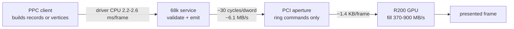
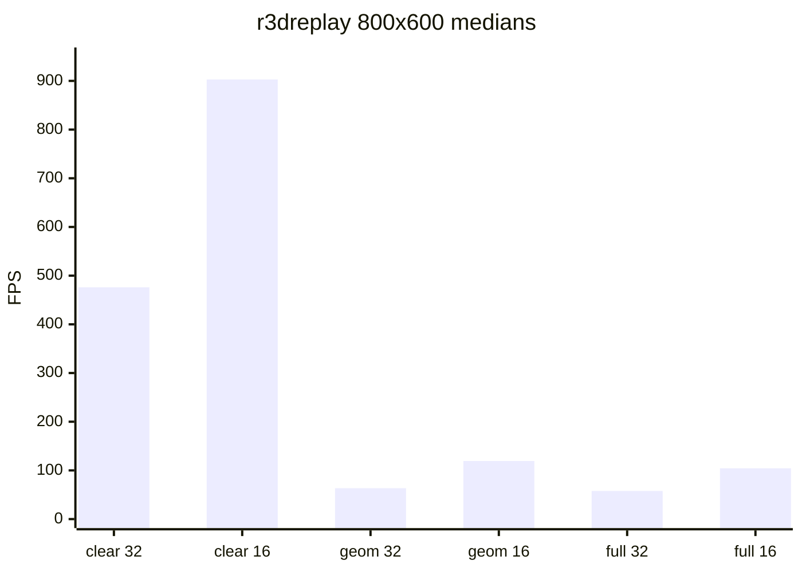
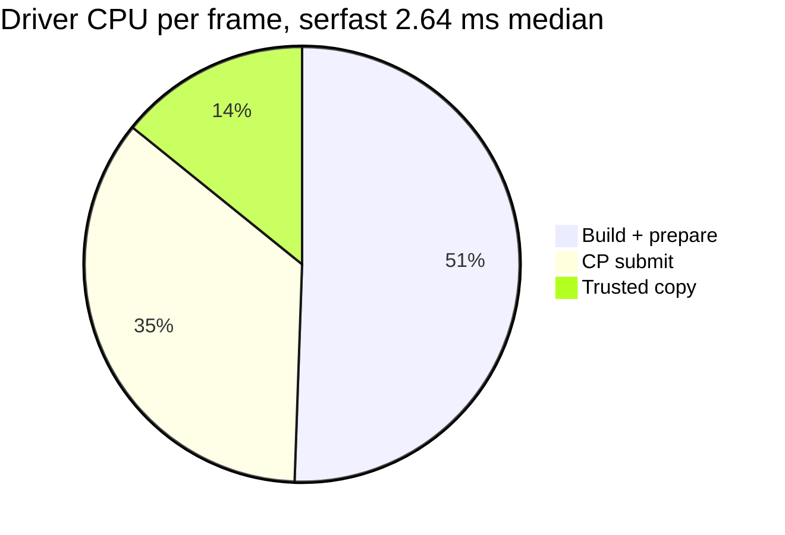

# 04 - Performance reference

This document collects every measured performance figure that is still useful
to a developer, with the metadata needed to interpret it, plus the rules for
producing new numbers. Read
[`01-ppc-client-guide.md`](01-ppc-client-guide.md#7-memory-endianness-and-cache---ppc-checklist)
for the client-side implications and [`06-testing.md`](06-testing.md) for the
procedures.

**Status warning.** There is no published, current 2D baseline for the
interface-19 HEAD. All 2D figures below are historical and were collected on
older artifacts (pre-3.0 state shadowing, pipelining, backpressure, DVI,
all-minterm copy). They explain design decisions; they are not current driver
performance. The newest 3D figures come from the consumer stack (MiniGL) and
are marked with the driver artifact they used. Do not combine numbers from
differently identified artifacts.

## 1. Reference machine and unit conversions

| Property | Value |
|---|---|
| CPU | Motorola 68060 @ 50 MHz, FPU, 68020-60 code |
| PPC | MPC7410 WarpOS (for PPC-side measurements) |
| Bridge | Prometheus/FireBird, PCI aperture mapped `CacheInhibit I/O` |
| GPU | RV280 Radeon 9200, `1002:5964`, 128 MiB VRAM, 64 MiB aperture |
| EClock | 709,379 Hz (1 tick = 1.4097 us = **70.5 CPU cycles**) |
| CPU cycle | 20 ns at 50 MHz |
| DateStamp tick | 50 Hz (20 ms) |

Conversions used in the tables:

```text
cycles = ns / 20          (at 50 MHz)
us     = ticks * 1e6 / 709379
```

The EClock resolution is about 1.4 us, so per-call numbers for tiny batches
are quantised. Trust accumulated totals and frame-level sums; `ReadEClock()`
itself was measured well under a microsecond.

Where a frame's time goes, with the measured order of magnitude on each hop:



## 2. Cycle-cost table

All values measured on the reference machine; "cycles" is the derived 68060
figure at 50 MHz. These are elapsed times, not exclusive CPU time (they
include bus stalls).

| Operation | Measured | Derived cycles |
|---|---:|---:|
| Radeon MMIO register read | 1.45 us | ~72 |
| Radeon MMIO register write | 1.33 us | ~66 |
| Framebuffer aperture dword write | 0.61 us | ~30 |
| `HOST_DATA0` dword write | 1.33 us | ~66 |
| Byte-swapped VRAM dword store | 0.752 us | ~38 |
| Fast-RAM sequential dword store | ~0.14 us (27.7 MB/s) | ~7 |
| `ReadEClock()` | < 1 us | < 50 |
| 4096-dword CP batch, small/buffered path | 3.860 ms | 47.1/dword |
| 4096-dword CP batch, direct streaming path | 3.170 ms | 38.7/dword |
| 8 KiB aperture burst | 1.242 ms | 30.3/dword |
| 64 KiB aperture burst | 10.413 ms | 31.8/dword |

The aperture write path is the fundamental ceiling for everything the host
pushes to the card: **~6.1-6.3 MB/s** (flat from 8 KiB to 1 MiB blocks),
byte-swapped stores ~5.3-5.4 MB/s. GPU-to-VRAM fills never traverse this bus;
the CPU aperture carries only ring commands and CPU-written texture/vertex
data.

## 3. PCI access costs (Phase 0 hardware results)

First physical version-14 run, RTL8139 installed, Workbench 1024x768, no crash:

| Check | Result |
|---|---:|
| Service discovery | v2 library, v1 interface, generation 2 |
| Device/caps | `5964`, CP ready + single board (`0x00000003`) |
| Installed / P96 VRAM | 64 MiB / 64,995,328 bytes |
| MMIO read / write | 1.45 us / 1.33 us per access |
| 8 KiB aperture write | 881 ticks, 6.29 MiB/s |
| 64 KiB aperture write | 7,387 ticks, 6.00 MiB/s |
| 4096-dword buffered CP | 2,738 ticks, 3.860 ms |
| 4096-dword direct CP | 2,249 ticks, 3.170 ms |
| Direct-path saving | 17.9% (1.217x) |
| Forced ring wrap | success, WPTR 258,112 -> 16 |
| Ordered fences | success, sequence 1 -> 2 |
| `BoardLock` callback samples | 171,535 owned, 0 other/unowned |

The MMU maps the whole Prometheus aperture `0x40000000-0x5fffffff` as
`CacheInhibit I/O space`; the measured aperture rate is only narrowly above the
5 MiB/s reassessment threshold, which is why the service keeps its own
two-span direct ring implementation instead of exposing a raw client ring.

### 3.1 Aperture vs register writes (template staging analysis)

| Path | Cost per dword |
|---|---:|
| Aperture write | 0.61 us (30 cycles) |
| `HOST_DATA0` register write | 1.33 us (66 cycles) |
| Ratio | 2.19x |

`BlitTemplate` spends about 84.7-94 non-burstable register writes per call and
is over half (75% in the measured interactive mix) of all PCI time. The
`TEXTSTAGE` VRAM-staging experiment would cut a template blit from roughly
126 us to 72 us, but it wedges the 2D engine on the reference machine and is
disabled (see [`05-build-deploy-run.md`](05-build-deploy-run.md#41-tooltypes)).

The adopted optimisation is different: `HOST_DATA0` is streamed **without
mid-upload FIFO polls** (the RV280 throttles the stream itself, matching the
closed shipping drivers). Measured effect on real strings at 16bpp:

| Workload | Hardware text (ticks) | rtg.library CPU default (ticks) |
|---|---:|---:|
| 4096x `Text("P96Speed")` | 60 | 108 |
| 64px template | 32 | 123 |
| Single character | 47 | 33 (software wins) |

## 4. Command processor and submission

- The ring is 1 MiB of private VRAM; the CP microcode is loaded at init.
- The fence tail is a 6-dword cache flush + full idle wait + scratch write.
  Every fenced submission therefore pays a **full GPU idle drain**, which is
  why batching matters far more than saving a few dwords.
- The ring write path was fused: `CpBurstCopySwapped()` now loads 8 dwords,
  swaps in registers and stores with one `movem.l`, eliminating an eight-word
  stack stage. The complete copy function shrank from 212 to 160 bytes.

Measured effect of the fused CP copy (three bridge-cold-rebooted 600-frame
runs per build, 640x480x32 fullscreen, two buffers, BLIT, no sync, priority
-1, same texture correction in both builds):

| Driver | Samples (50 Hz ticks) | Reported FPS |
|---|---|---:|
| Old CP, `6B860EE0` | 556, 551, 547 | 53.956, 54.446, 54.844 (median 54.446) |
| Fused CP, `9768419A` | 526, 522, 524 | 57.034, 57.471, 57.251 (median **57.251**) |

Median improvement **+5.2%**; CP submit elapsed fell **2.582 -> 1.152
ms/frame (-55.4%)** at identical dword counts (194,010 in / 510,189 generated
per 600-frame run). These are elapsed phase intervals, not exclusive CPU time.

The buffer copy itself was already near the bus floor; the remaining submit
cost is the fence drain and the final-dword readback ordering, both required
for correctness.

### 4.1 Ring back-pressure

An unpaced client can outrun the GPU until the ring-space wait
(`CP_TIMEOUT_POLLS`) expires. The service treats a failed submit as CP death
and runs full recovery, invalidating the session; three of nine unpaced
2000-frame replay runs hit this (`fail=1188..5712`). A real client paces per
frame. This remains a robustness follow-up: a ring-full timeout is not a CP
hang, and recovery there is aggressive.

## 5. 3D ceilings - the replay benchmark

`tools/r3dreplay.c` issues only three prebuilt API calls per frame (one clear
Execute + two TCL state batches, rotating only the model-projection matrix),
with vertices pre-written into two 256 KiB segments. It is the reference
ceiling probe: same inputs, zero client variance.

800x600, 2000 frames, `-pace 64`, fail=0, three runs each, median (RV280,
driver interface 16, generation 5, warm session - not a formal baseline):

| Configuration | Median FPS | ms/frame |
|---|---:|---:|
| Clear only, 32bpp | 476 | 2.10 |
| Clear only, 16bpp | 903 | 1.11 |
| Geometry only (6480 small tris), 32bpp | 63.4 | 15.78 |
| Geometry only, 16bpp | 119.3 | 8.38 |
| Full, 32bpp, visible screen | 57.75 | 17.31 |
| Full, 32bpp, offscreen target | 54.6 | 18.31 |
| Geometry only, 32bpp, offscreen | 70.2 | 14.25 |



Readings:

- The R200 clear (two huge triangles) runs at **~900 MB/s** - native engine
  rate, proving GPU-to-VRAM fills never traverse the ~6 MB/s CPU aperture. The
  ring commands themselves are only ~1.4 KB/frame (~0.25 ms).
- Geometry runs at ~300-336 MB/s and scales with bytes per pixel; the ceiling
  is per-triangle rasteriser setup plus RV280 memory bandwidth, not the bridge
  and not the 68k.
- Scanout is free (offscreen equals screen within noise).

Depth-attached replay (gears shape: color clear + Z16 clear/test/write), same
protocol:

| Configuration | Median FPS | ms/frame |
|---|---:|---:|
| Full, 32bpp, color-only clear | 53.6 | 18.7 |
| Full, 32bpp, +Z16 clear/test/write | 62.8 | 15.9 |
| Full, 16bpp, color-only clear | 104.4 | 9.6 |
| Full, 16bpp, +Z16 clear/test/write | 100.3 | 10.0 |

- Depth-enabled 16 vs 32 ratio is **1.60x**, matching the 4-to-6
  bytes-per-pixel bandwidth prediction (the older "2x at 16-bit" claim
  compared color-only cells and was never valid for a depth-tested workload).
- Depth *enabled* is faster than color-only at 32bpp: early-Z culling on the
  self-occluding torus removes more overdraw than the Z traffic costs.
- Gears-shaped 16-bit ceiling at 800x600 is ~100 FPS; the measured real stack
  (57.8 at 32bpp) is client/present/pipeline-limited.

## 6. Driver CPU per frame

`radeon3dinfo` after a workload dumps cumulative `R3DEXEC` totals and a
1024-entry `R3DSAMPLE` ring; `tools/perfplot.py` groups samples into frames.
Measured attribution (elapsed phase intervals, **not** exclusive CPU):

| Workload | Frame period | Driver CPU/frame | Split |
|---|---:|---:|---|
| serfast PPC stack (300 frames) | 17.1 ms | 2.64 ms median | build 50.6%, submit 35.3%, copy 14.2% |
| Synchronous 68k client | - | 2.23 ms/frame | - |
| Pre-serialized replay | - | 1.05 ms/frame (103 record dwords) | GPU-bound loop with multi-ms submit stalls |



The driver is ~15% of the serfast frame; the client and GPU own the rest. For
the older asynchronous host shape, ring wall-clock phase times are inflated by
host-task descheduling while the PPC renders - use the synchronous 68k client
and serfast as trustworthy anchors.

## 7. PPC memory placement

The WarpOS/Sonnet task allocator hook redirects `PUBLIC`/`FAST` allocations to
PPC RAM even when `LOCAL` is set. The driver's private working buffers were
therefore landing in PPC RAM and the 68k paid PCI-memory latency for every
access. `AllocExecuteMemory()` now requests only `MEMF_LOCAL`, verifies FAST
with `TypeOfMem`, and falls back to public allocation.

CPU-only emitter benchmark (`tools/r3demitbench.c`, EClock ticks, 200 repeats):

| Case | PPC RAM ticks | Local Fast ticks | Ratio |
|---|---:|---:|---:|
| 1 draw | 212,353 | 43,886 | 4.84x |
| 5 draws | 237,079 | 60,499 | 3.92x |
| 20 draws | 354,134 | 102,339 | 3.46x |

The 20-draw case emits 419 dwords (CRC `A8A11546`) on both paths. These are
single-session diagnostic samples, not benchmark medians.

Production effect, six independent bridge cold reboots (three per build),
600-frame precalc gears, 640x480x32 fullscreen, two buffers, no sync, host
priority -1, identical card/library/DLL/host:

| Build | Samples (ticks) | FPS |
|---|---|---:|
| Original `07A7193D` | 674, 677, 677 | 44.510, 44.313, 44.313 (median 44.313) |
| Corrected `23ACBAEC` | 551, 547, 549 | 54.446, 54.844, 54.644 (median **54.644**) |

Median **+23.3%** (22.567 -> 18.300 ms/frame). Comparable A3/B3 phase deltas
(ms/frame):

| Phase | Original | Corrected |
|---|---:|---:|
| Copy | 0.878 | 0.708 |
| Build + prepare | 9.147 | 4.918 |
| CP submit | 3.272 | 2.590 |

I/O dword counts were identical (194,010 in / 510,189 generated per run).
Other private session/surface structures remain in PPC memory; only the three
execute buffers were moved. This is a real placement penalty and throughput
improvement, **not** recovery of the recalled ~100 FPS.

## 8. Real-stack 3D checkpoints

Numbers are only comparable within a row's stated artifact generation. All are
640x480 or 800x600 as noted; "gears" is the MiniGL textured torus workload.

| Date | Driver | Workload | Result |
|---|---|---|---|
| 2026-08-17 | interface 7, `1E15D4DC` | Fullscreen textured gears, 3 submits/frame, 8192-dword cap | 4.919 / 4.925 / 4.946 FPS, mean **4.930** |
| 2026-08-17 | interface 7 | 16384-dword cap test | 4.932 FPS mean, no gain; 8192 retained for board-lock fairness |
| 2026-08-21 | interface 8, `B0FE2D03` | Fullscreen gears, native quad lists | 4.971 / 4.963 FPS; workload fell 3320 -> 2760 submitted vertices, 20336 -> 16946 record dwords, 21834 -> 18338 generated dwords |
| 2026-08-30 | interface 16 state batches | Windowed 800x600x32 envmap gears | median **52.456 FPS** |
| 2026-08-30 | interface 17 client CP streams | Same workload | 46.8 FPS median - **rejected**, see below |
| 2026-09-07 | `23ACBAEC` (local-memory fix) | 600-frame precalc gears, 640x480x32 FS | median **54.644 FPS** |
| 2026-09-07 | `9768419A` (fused CP copy) | Same | median **57.251 FPS** |
| 2026-09-12 | `CEB838A6` + PPC CP emitter | Windowed 800x600x32 gears, 600 frames, 2,031 indirect submissions, 511,620 CP dwords | **68.337 FPS**, no GL/dispatch errors |
| 2026-09-12 | consumer stack | Fullscreen 640x480x16, three buffers, precalc, semantic submission | **134.529 FPS** |

The interface-17 client-CP-stream experiment (validated streams emitted on the
PPC side) passed every correctness gate - 1,350 submitted streams, zero
rejects, all native suites green - and failed only the performance gate. Per
stage: `RadeonCpWait` drain 4.2 ms/frame, 2.5 us/dword validator walk
2.7 ms/frame, trusted copy 1.9 ms/frame. The full implementation is preserved
on the `phase2-cp-stream` branch (`32afdf1`).

## 9. 2D history (all historical, pre-3.0 artifacts)

### 9.1 Complete-copy minterm fix

The generic `BlitRectNoMaskCompleteDefault` path consumed essentially the whole
delay for complete-copy opcode `$6` (source XOR destination) plus physically
overlapping surfaces. Mapping all 16 four-bit minterms to ROP3 and choosing a
safe direction produced (release card `B6239209`):

| Metric | Before | After | Devil's Cut reference |
|---|---:|---:|---:|
| Whole `p96windowmove` benchmark | 9.693-9.732 s | **177.773 ms** | 124.193-125.113 ms |
| Open mover over target | 9.539-9.572 s | **11.727 ms** | 10.916-11.574 ms |

The overlap-open stage improved ~**815x** and came within the closed-driver
range. This is the single largest 2D improvement recorded.

### 9.2 Overlapping-window benchmark (`p96overlap`)

Fixed 640x480x16 target split by three borderless windows into 1 visible empty
`ClipRect` and 19 overlapping rectangles (10 visible, 9 obscured), 12
iterations, median of seven trials:

| Driver/run | Empty median | Overlap median | Ratio | Penalty |
|---|---:|---:|---:|---:|
| Radeon9200 run 1 | 256.802 ms | 337.529 ms | 1.314x | 80.726 ms |
| Radeon9200 run 2 | 258.767 ms | 345.964 ms | 1.336x | 87.197 ms |
| Devil's Cut run 1 | 203.511 ms | 276.183 ms | 1.357x | 72.672 ms |
| Devil's Cut run 2 | 205.805 ms | 277.789 ms | 1.349x | 71.984 ms |

Devil's Cut was ~20.6% faster empty and ~19.0% faster overlapped, with the
same layer geometry: its advantage was a broadly cheaper rendering workload,
not a different overlap dispatch. Component attribution (version 2) showed
text was ~94% of the empty workload and 84-86% of the overlapped workload, and
Radeon9200's text was ~30% slower; the repeated-`HOST_DATA0` prototype later
closed about 39% of the empty and 44% of the overlap text gap.

### 9.3 Moving-window benchmark (`p96windowmove`)

The version-7 complete-copy fix is the headline (section 9.1). Earlier
versions (3-4) showed movement submission itself was close to the closed
driver (empty/overlap per move within ~4-19%), while whole-process time was
dominated by initial text/refresh work: version 4 measured 127.555 s whole
benchmark against 0.182 s for Devil's Cut, with time outside the movement
phases at 127.508 s versus 0.140 s. Version 6 caps initial text at three rows
per window to keep the benchmark runnable.

### 9.4 P96Speed automation

P96Speed 1.2 has no batch mode; it is driven through MCP input and filesystem
commands. The historical automation procedure (window at `(0,0)`, 21 tests x
13 s, minimum 283 s uninterrupted wait, `RAM:P96Speed.txt` is appended not
replaced) is in [`06-testing.md`](06-testing.md#33-p96speed). Historical results
(RectFill 2593 ops/s, RectFill Pattern 1387 ops/s) predate 3.0 and are not a
baseline.

## 10. What the numbers imply for client design

1. **Batch aggressively.** One fence drain costs milliseconds. A frame should
   have a handful of submissions, not dozens. The service caps a call at 8192
   dwords; the MiniGL frontend reduced gears from seven submits to three per
   frame and 16384-dword batches bought nothing.
2. **Prefer streaming commits for geometry.** Vertex-fetch commits keep record
   chains small (a T5 gears measurement: 2761 dwords/frame, 91% below inline)
   and move the vertex traffic once into VRAM.
3. **Keep 68k working memory out of PPC RAM.** 3.5-4.8x on the emitter loop,
   +23% on gears.
4. **Write to the aperture once.** Every byte that must cross the bridge is
   ~30 cycles; every register write is ~66. Streaming segments avoid a second
   copy.
5. **Do not chase CPU flags or hand assembly for the emitter first.** The
   measured build phase is ~50% of driver CPU; atom-level output reservation
   and merged record walks are the identified next steps (see
   [`07-history.md`](07-history.md#4-open-optimisation-candidates)).
6. **Fill bandwidth is the wall for large targets.** At 800x600x32 the stack
   is GPU-fill-bound at ~57-58 FPS with ~370-410 MB/s effective fill; 16-bit
   with depth tops out near 100 FPS. Reduce overdraw/clear traffic before
   optimising the host.

## 11. Producing publishable numbers

Every accepted run must record:

- Git commit and whether the working tree was clean.
- Size, SHA-256 and CRC32 of `Radeon9200.chip` and `Prometheus.card`.
- Release / DEBUG / FASTWAIT / PROBES configuration and build flags.
- CPU and clock, bridge model, Radeon PCI id/revision, VRAM, ROM type,
  `rtg.library` and benchmark versions.
- Complete active monitor ToolTypes and Workbench/benchmark modes.
- EClock frequency, cold/warm boot state, run order, raw output, all samples.

Then follow the version-3.0 baseline procedure in
[`06-testing.md`](06-testing.md#4-baseline-procedure). Report median, mean, range
and individual trials; change one variable at a time; use three independent
runs with the required cold-boot protocol; never mix DEBUG timings with release
performance.

Tooling:

| Tool | Purpose |
|---|---|
| `tools/radeon3dinfo.c` | `R3DINFO`/`R3DEXEC`/`R3DCLOCK`/`R3DSAMPLE` capture |
| `tools/perfplot.py` | frame grouping, per-phase medians/p95, ASCII waterfall, optional matplotlib charts, DEBUG 2D attribution |
| `tools/decode_debug_stats.py` | decode the `Radeon9200.Debug` block |
| `tools/r3dreplay.c` | pre-serialized ceiling probe |
| `tools/r3demitbench.c` | CPU-only emitter cost, placement A/B |
| `tools/p96screen.c` | focused 2D readback + timing gate |
| `tools/p96overlap.c`, `tools/p96windowmove.c` | layers.library / Intuition workloads |
| `tools/r3dtexupdate.c` | texture visibility gate with per-draw timing |

A successful build is not hardware validation, and a successful benchmark run
on one artifact says nothing about a later working tree.
