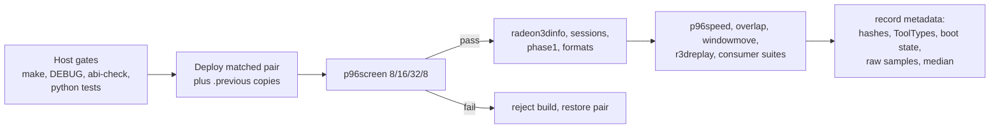

# 06 - Testing and validation

A successful build is **not** hardware validation. This document lists every
test asset in the tree, what it covers, and the procedures required before a
change can be called validated.

## 1. Host-side build and logic gates

Run these on the development host; none of them touches the Amiga.

| Command / test | What it proves |
|---|---|
| `make` | Release chip and card compile warning-free (`-Werror` for the chip) and link with no undefined symbols |
| `make DEBUG=1` | Debug chip/card compile and link |
| `make abi-check` | Public structures have identical size/layout/offsets under GCC and vbcc |
| `make r3d-tools` | All vbcc 68k service probes build |
| `make tools` | `p96screen`, `p96overlap`, `p96windowmove`, `rtgpresent` build |
| `make r3dreplay r3dtexupdate r3dib r3dstream vramstream` | Remaining probes build |
| `python3 tools/test_indirect_dispatch.py` | Extracts the production indirect-dispatch/usability/capability code and runs 94 cases with ASan/UBSan: hook ordering, valid id 0, malformed requests, bounds/overflow, prepare failure, prepare-with-invalidation, failed submits, missing fences, recovery without retry, `LastFence` ordering, short descriptors, caller mutation during prepare, odd-count rejection |
| `python3 tools/test_cp_drain_guard.py` | 20 source-structure checks: the 2D transition drains full idle (not `RB_RPTR`), the MMIO guard gating, and the SubmitFence kick shape |
| `python3 tools/test_cp_copy.py` | Extracts the real CP copy/commit functions: host exhaustive 2,816 copy + 5,934 commit cases (ASan/UBSan), native smoke 2,816 + 1,966, against a pinned baseline object |
| `python3 tools/test_tex_matrix.py` | Real emitter + texture-matrix fixture: 1,188 checks over all five matrix blocks, cross-unit changes, lighting fallbacks, promotion, capacity failure; also builds an early-return mutant and requires it to fail (139 failures) |
| `python3 tools/test_tex_serial.py` | Texture content serials 0/1/5/65535, both units, inline and committed draws, reserved low bits, invalid min filters; old-mask mutant must fail |
| `python3 tools/test_execute_memory.py -v` | `AllocExecuteMemory` selection, fallback, reuse, partial success directions, mixed pools, rejected Chip RAM cleanup |
| `python3 tools/decode_debug_stats.py <dump>` | Decodes a `Radeon9200.Debug` block (version 23) |
| `python3 tools/perfplot.py <capture>` | Parses `R3DSAMPLE` lines, groups frames, reports per-phase medians/p95 and estimated FPS |

Run the whole set before deploying anything to hardware. The Python tests
deliberately compile the *production* functions rather than reimplementing
them; if a refactor moves code the tests cannot find, they fail loudly.

## 2. 68k probes and what they cover

| Tool | Interface | Coverage | Output / exit |
|---|---|---|---|
| `radeon3dinfo` | any | Opens the service, dumps caps/VRAM/max batch, cumulative `R3DEXEC` totals, `R3DCLOCK` and the `R3DSAMPLE` ring | `R3DINFO`, `R3DEXEC`, `R3DCLOCK`, `R3DSAMPLE`; 0 ok, 10 service, 20 library |
| `radeon3dsessions` | any | 10,000 open/close cycles x2 batches, public-memory leak check (<= 1024 bytes on the second batch), stale-handle rejection after close | `R3DSESSIONS status=ok|leak_or_stale_handle|open_failed` |
| `radeon3dphase1` | 1+ | Malformed packet/bounds/flags/future-fence rejection, 70 fenced 8192-dword submissions crossing the ring wrap, triangle readback, immediate 3D->2D transition, import/release, planar rejection | `R3DPHASE1 status=ok ...` |
| `radeon3dformats` | 6+ | 8/16/32-bit semantic targets with exact readback, dithered RGB332 bounds, legacy-interface rejection, sphere-map samples (interface 12+) | `R3DFORMAT`, `R3DFORMATS status=ok` |
| `radeon3dstream` | 13+ | Raw segment commit: single and batch commit, fence stage encoding on bad args, VBUF draw renders identically to an inline control | `R3D...` |
| `r3dib` | 18+ | Trusted indirect dispatch gate: PACKET2 health, 64-dword IB, max 8192-dword IB at offset 4096, negative checks with documented error encoding, interface-17 rejection | `status=fence_timeout` on a timeout - treat the machine as suspect |
| `r3dreplay` | 13/15+ | Pre-serialized frame replay into a visible 800x600 screen; `-z` adds Z16; `-pace N` paces fences; `-offscreen` target mode; counts failed submits | `R3DREPLAY_SUMMARY` with FPS |
| `r3dtexupdate` | 17+ | Texture visibility gate: 176 verified draws over RGB565 and BGRA aux textures, 16 in-place write/sample rounds, release/reallocate reuse (16 observed address reuses) | 0 PASS, 5 pixel, 10 reuse not observed, 20 setup |
| `vramstream` | 13+ | Segment write throughput (fast RAM store/copy, VRAM store, byte-swapped store, fast->VRAM copy) | throughput table |
| `p96screen` | 2D | Format-specific fill, pattern, template, text, copy, mask, overlap and readback checks for 8/16/32-bit modes | `FAIL` on any check |
| `p96overlap` | 2D | layers.library split workload: empty vs 19 `ClipRect` overlap, median of seven trials | result table with `ClipRect` counts |
| `p96windowmove` | 2D | Intuition window move empty vs over a populated target, whole-process and stage timing | `TOTAL`, `STAGES`, `TRIALS`, `RESULT` |
| `rtgpresent` | - | Startup-sequence helper: RTG screen detection (returns 5/WARN otherwise) | exit code |
| `phase0host` + `ppcphase0` (WarpOS) | 0 | PPC reachability probe for the direct-ring design (`docs/09-ppc-direct-ring-design.md`): BAR2 MMIO read/write cost from the PPC, aperture store bandwidth (native and `stwbrx`), cross-CPU control-block ordering, 68k baseline measured in the same boot | `P0HOST`/`P0PPC`/`PPCPHASE0` lines; 0 ok |
| `chiptest`, `mglprobe`, `mglprobe2`, `dbgdump` | - | Small ad-hoc diagnostics | - |

## 3. Required hardware sequence



### 3.1 2D gate

```text
p96screen 8        # seconds default; use "test" for the full check set
p96screen 16
p96screen 32
p96screen 8        # return to CLUT8
```

Run the complete `8/16/32/8` sequence before accepting a build. Reject the
build on any readback, edge, mask, fallback or recovery failure. This gate is
mandatory for every driver change, including 3D-only ones (the 2D and 3D
engines share the baseline).

### 3.2 3D gate

With `CP=YES` and a matched pair installed:

```text
radeon3dinfo
radeon3dsessions
radeon3dphase1
radeon3dformats
r3dib            # only when touching indirect dispatch
r3dtexupdate     # only when touching texture residency/visibility
r3dreplay        # ceiling/regression probe
```

For a full release also run the consumer (MiniGL) acceptance suites: bootstrap,
phase4/5/6/7, arrays/FastPath/window/resize/context-loss, and the texture-update
test (7,127 checks over two contexts). Those live in the MiniGL tree; this
repository's probes prove the driver side of the contract.

### 3.3 P96Speed

P96Speed 1.2 has no batch mode. The validated automation (MCP input commands):

1. Launch `C:P96Speed`; move the 738x538 window to `(0,0)`.
2. Preferences tab -> Screenmode chooser -> `Radeon 9200: 640x480 16bit PC`;
   confirm; Own Machine tab.
3. `Run all tests`; wait at least `21 * 13 + 10 = 283` seconds without probing
   the bridge (the validated run produced no stable screenshot until ~313 s).
4. Save results to `RAM:P96Speed.txt` (P96Speed **appends** another 1,889-byte
   report if the file exists - delete/rename it first), then copy to a unique
   name, checksum and pull it.
5. Cold reboot before focused `p96screen` timings; the long session inflates
   otherwise stable timings even after the window closes.

Gadget ids observed: 104 page/tab, 47 Save results, 41 Run all tests, 46 Quit.
Coordinates are more reliable for page tabs and the ASL requester.

### 3.4 `p96overlap`

```text
make tools
# deploy build/p96overlap, then:
Work:p96overlap >Work:p96overlap-result.txt
```

Optional argument changes iterations per trial; the default 12 is the
comparison value. Run twice and retain both outputs plus the `ClipRect` counts.
Matching `ClipRect` counts but different times attribute the difference below
layers.library (P96 dispatch/driver callbacks); different counts mean the
configurations are not exercising the same geometry and timings are not
comparable.

### 3.5 `p96windowmove`

```text
make tools
Work:p96windowmove >Work:p96windowmove-result.txt
```

Version 7 uses three measured trials, no warmups, one round trip each (6 moves
per state, 12 total). The optional cycle argument is clamped to the one-cycle
default. Compare `us_per_move`, the overlap ratio and the absolute overlap
penalty using the exact same executable and display mode. Note that
`p96windowmove` was written for a **1024x768x16** private screen; the version
in this tree may require that mode to be available.

### 3.6 Phase-0 PPC reachability probe

Build both halves with `make phase0` (the PPC half needs the local
`vbcc` `+warpos` target; see the `phase0` target in the Makefile). Deploy
`build/phase0host` and `build/phase0/ppcphase0` to the machine (short names,
CRC-verified). Run with the matched pair installed, `CP=YES` active, and **no
3D client rendering**:

```text
Work:phase0host
```

The host prints the BAR addresses, the 68k baseline measurements, and the
exact command line to run on the same machine:

```text
Work:ppcphase0 <controlSegmentAddressHex>
```

Then read the joint summary from the host's console (`P0PPC ...` lines,
including the `scratch68k`/`scratch_match` cross-check that proves the PPC's
byte-reversed MMIO store reached the register in the expected shape). Accept
the probe only if: the block handshake completes, MMIO reads return sane
register values, `stwbrx_ok=1`, `scratch_match=1`, and both bandwidth
figures are plausible against the 68k baseline. Record the output with the
standard artifact metadata. The host times out after 120 s if the PPC never
acknowledges; both segments are freed on every exit path.

## 4. Baseline procedure

For a version-3.0 baseline (2D or 3D):

1. Build a clean release pair; record the metadata from
   [`04-performance.md`](04-performance.md#11-producing-publishable-numbers).
2. Cold boot with the validated ToolTypes.
3. Run the `8/16/32/8` `p96screen test` gate; reject on any failure.
4. Run P96Speed at `640x480x16`, 13 s per test, at least three times under the
   same conditions; preserve every raw report.
5. Cold reboot before focused tests.
6. Run current `p96overlap` twice, retain every trial and `ClipRect` count.
7. Run current `p96windowmove` twice, retain `TOTAL`, `STAGES`, `TRIALS`,
   `RESULT`.
8. For a 3D release: `radeon3dinfo`, `radeon3dphase1`, `radeon3dsessions`,
   `radeon3dformats`, `r3dreplay` and the MiniGL acceptance executables;
   record exact artifact hashes and summary lines.

Focused attribution: `p96screen <depth> <seconds> test` reports complete-copy,
fill, scatter-fill, template, text and copy measurements. DEBUG builds publish
the `Radeon9200.Debug` block; decode with `decode_debug_stats.py` and take
deltas around exactly one workload. DEBUG timings are diagnostic and must not
be mixed with release performance.

## 5. Regression rules

- Never weaken a check to make a run pass. Fix the code or document the new
  expectation and update the probe in the same commit.
- When a test fails, first check whether it fails identically on a clean
  baseline boot with its own chip/library. Streaming bring-up produced
  `cull_shade`/`phase4_smoke` failures that were pre-existing on the branch,
  not regressions.
- A missing result (e.g. no observed texture-address reuse) is not a pass.
- Keep the previous matched pair so a failed experiment can be rolled back; a
  hardware run that required recovery is evidence about the recovery path, not
  about the change under test.
- Record cold/warm state: bridge reboots are not operator power cycles, and
  the two are not interchangeable evidence.
