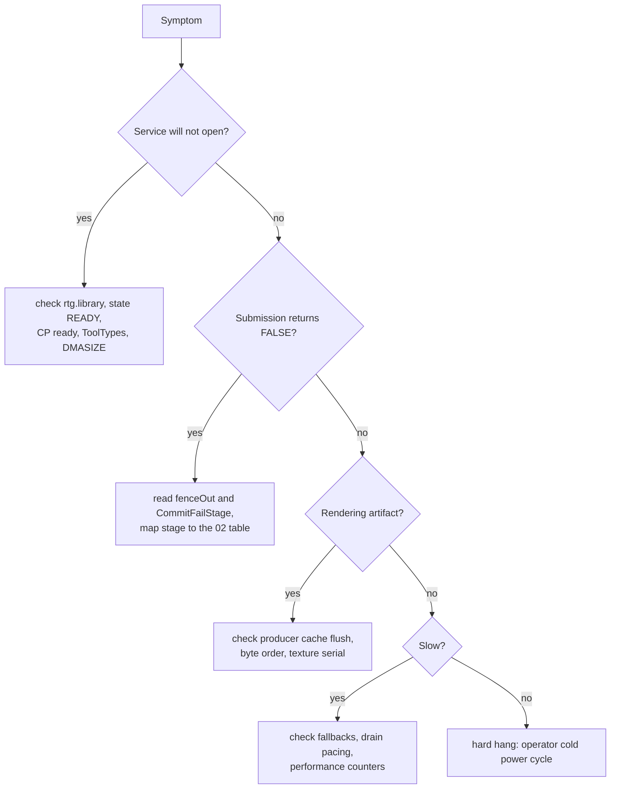

# 08 - Troubleshooting and recovery

Read [`05-build-deploy-run.md`](05-build-deploy-run.md) first for the recovery
layers and the physical-machine rules. This document maps symptoms to likely
causes.

## 1. Service will not open

`Radeon3DOpen()` returns NULL when any of these fail:

| Check | Likely cause | Action |
|---|---|---|
| `rtg.library` cannot be opened | no RTG driver loaded | install the matched pair, cold boot |
| `ServiceState != READY` | board not attached, init failed, or detaching | check `InitChip`/`InitRadeonFeatures` succeeded; verify ToolTypes and `DMASIZE` |
| `BoardInfo` missing or `!Initialized` | Radeon initialization aborted | run a DEBUG build and read `Radeon9200.Debug` (`CpRequested`, `CpActive`, `DmaReserved`, `BoardMemorySize`) |
| `!RadeonCpIsReady` | CP not initialized or recovery failed | `CP=YES` must be set; check for CP bring-up failure in the debug stats |

If the library itself does not open, remember it is opened by resident name
`Radeon9200.chip`. A chip file installed under a different file name will still
load for Picasso96 (which loads by path) but will break every client that opens
the name - including `minigl.library`.

## 2. Commit and submission failure stages

Failed calls write `0x80000000 | stage` (or `0x80000000 | (group << 16) |
stage`) to `fenceOut`; the most recent commit stage is also in
`Radeon3DInfo.CommitFailStage`. The stage tables are in
[`02-service-abi-reference.md`](02-service-abi-reference.md#12-fence-and-error-semantics).
Quick interpretation:

| Stage | Meaning | Usual fix |
|---:|---|---|
| 1-2 | malformed call / interface too old / working buffers unavailable | check `Size`, flags, interface negotiation; a commit before the first Execute allocates buffers automatically, so 2 means allocation failure |
| 3-5 | record chain structure, unexpected record type, count mismatch | ensure every record's `dword[1]` is correct and `RecordCount` matches the number of draw records; clears consume no vertex offset |
| 6-7 | emitter rejected a record or `RadeonPrepare3D` failed | inspect `StateBatchFail*` in a DEBUG build; check floats/state enums/aliases |
| 8 | ring submit failed | CP problem or ring-full timeout; see section 4 |
| 40-44 | batch wrapper/segment/offset validation | check `SegmentId`, live lease, `VertexOffsets` range |
| 80-86 | state batch wrapper/copy/descriptor/emitter/submit | `Generation` must equal the live service generation |
| 100-108 | indirect descriptor/session/segment/range/prepare/stale | check alignment 16, even count, lease extent; 107/108 mean prepare recovered and invalidated the session |
| 110-116 | `Radeon3DSubmitFence` (parked feature) | do not use on a non-interface-19 driver |

`CommitFailStage` is overwritten by each commit attempt, and the indirect path
uses it to carry a diagnostic trail (`0xc5000000 | mode<<16 | endian<<8 |
wptr`), so read it immediately after the failure.

## 3. Rendering artifacts

| Symptom | Likely cause |
|---|---|
| Geometry flickers or shows stale vertices, "works until memory pressure" | PPC producer did not flush its data cache over the segment range before commit/dispatch |
| Garbage triangles, CP stall after a streaming commit | Vertex data written host-endian; the vertex fetcher is little-endian. Byte-swap floats/dwords in the producer |
| Textured surface never updates after an in-place rewrite | This RV280's texture cache does not re-read rewritten lines at the same address. Bump `RADEON3D_TEX_CONTENT_*` in `textureState` or re-import residency at a fresh address (the MiniGL frontend does the latter) |
| Whole-screen corruption or wedge after an indirect dispatch | The indirect stream is trusted raw packets; a malformed stream can corrupt VRAM/registers. Recover, then compare against a validated stream. Extent checks do not sandbox packet effects |
| Black boxes / wrong clear rectangles behind HUD or icons | Depth-only clears relied on `RB3D_PLANEMASK` alone; the 6-vertex clear quad painted the clear colour over the rectangle. The working tree fixes this with a no-op blend (src ZERO, dst ONE) plus a forced clear-state re-emission - commit it before releasing |
| Second object drawn with the previous object's transform | Historical texture-only state promotion bug (fixed by keeping matrix uploads on the common path). If it reappears, check `EmitExecuteStateCached`/`TextureOnlyDelta` ordering |
| Lit pixels identical to unlit | TCL lighting enabled without `R200_OUTPUT_COLOR_0` (historical fix). Verify the emitted TCL output component select |
| Quake-style per-face draws extremely slow | Draw-bound: per-draw state re-emission, not vertex transport. Batch state with `CommitStateBatch`/reuse records |

## 4. Fences, timeouts and recovery

- A fence timeout after an indirect dispatch means the IB registers or fetch
  path are wrong. Treat the machine as suspect and follow the hardware
  recovery protocol before drawing conclusions.
- `Radeon3DWaitFence(dev, fence, 0)` is a single test; a nonzero timeout is a
  wall-clock budget clamped to 60 s.
- `Radeon3DClose()` waits up to 1 s for the session's last fence and then
  triggers recovery if it never retires.
- A failed submission runs bounded recovery (`RadeonRecoverAcceleration`:
  invalidate sessions, reset the engine, reload and self-test the CP, re-arm).
  Existing sessions are stale afterwards and must be reopened; surface handles
  and segments are gone.
- **Ring back-pressure is misclassified as CP death.** An unpaced client that
  fills the ring for `CP_TIMEOUT_POLLS` iterations causes a full recovery and
  session loss. Pace submissions (wait on a fence every N frames, as
  `r3dreplay -pace` does). This is a known robustness gap, not a hardware
  fault.

## 5. 2D problems

| Symptom | Likely cause |
|---|---|
| Drawing correct but very slow | The operation fell back to the P96 software callback. Reasons: off-board/Fast-RAM surface, pitch not 64-byte aligned or > 16320, coordinates > 8191, unsupported pattern/template mode, unrepresentable format. DEBUG stats record per-callback hardware/software counts and rejection reasons |
| Text much slower than expected | `HWTEXT=NO`, or the workload is single characters (software wins there), or the CP transition drain is being paid per call |
| Machine wedges after enabling `TEXTSTAGE=YES` | Known broken experiment. Cold power cycle, then boot with `TEXTSTAGE=NO` |
| Engine wedged by 2D work, subsequent draws blank | Bounded waits should detect and recover; check DEBUG `RecoveryCalls/Success/Failure`, `LastWaitStatus/Kind/Pending`, `FinalAccelState`. Failed recovery leaves acceleration unsafe (software fallback) |
| Window move/open takes seconds | Historical complete-copy opcode issue (`$6` = S XOR D); current driver maps all 16 minterms. If it returns, check `CompleteOpcode[16]` distribution and overlap direction selection |
| Overlap workload much slower than a closed driver | Expected on old artifacts; layers.library splits the render. Compare `ClipRect` counts before comparing times |

## 6. Display and DVI

| Symptom | Likely cause |
|---|---|
| No display after install | Wrong ToolTypes, missing `DMASIZE`, or unsupported board. Use `OUTPUT=VGA`, 640x480@60, and a serial/native recovery path |
| Workbench falls back to native PAL | `BOARDTYPE` and `SETTINGSFILE` were not switched together, or the driver failed and the automatic recovery restored the previous pair (check `RAM:driver-autorecovered`, `RAM:driver-fallback`, `S:driver-boot-failed`) |
| DVI output absent or unstable | The COMBIOS profile is not the validated internal-TMDS one, or the DFP PLL table is missing. The driver falls back to VGA; do not force generic PLL values |
| Mode available but wrong clock | PLL quantisation. DVI is capped at 164.75 MHz to stay under the 165 MHz single-link limit after rounding |
| Panning coarse | CRTC eight-byte granularity is a hardware limit |

## 7. Debug-chip boot hangs

Symptoms: the machine never returns from boot, the bridge never comes up, and
an operator cold power cycle is required.

Known causes and rules:

1. **Boot-time probes.** MMIO/VRAM sampling, CP no-op batches, the CP function
   matrix, the indirect-buffer matrix and the fallback probe can wedge the
   engine before the bridge exists. They are behind `RADEON_BOOT_PROBES`
   (`make DEBUG=1 PROBES=1`). Install only probes-off debug builds as active
   drivers.
2. **Stale CSQ partition in the probe path.** The probe must restore
   `CP_CSQ_CACHE_PARTITION` (`0x5010`), not `0x4d4d`; 64-dword indirect buffers
   time out under the starved partition.
3. **libdebug output during `LoadMonDrvs`.** `RLOG()` is now a no-op in all
   builds for this reason.

After a hang, recover with the documented `S:startup-sequence` right-mouse
block (both `.previous` files must exist), and re-verify the installed release
pair by CRC.

## 8. Memory and session hygiene

- `radeon3dsessions` is the leak/stale-handle gate: 10,000 open/close cycles
  per batch, second-batch public-memory loss must be <= 1024 bytes, and a
  closed handle must fail `Radeon3DGetInfo`.
- `Radeon3DClose()` releases segments, surfaces and the owner pin. A client
  that exits without closing leaves the chip library's session count elevated;
  `LibClose` then defers expunge.
- Surfaces still held when the device closes are released with it; imported
  `BitMap`s are the caller's to free after `Radeon3DReleaseSurface` returns.
- Aux surfaces never overlap P96 bitmaps or screen buffers by construction;
  imported depth can. Always allocate depth with `Radeon3DAllocSurface`.

## 9. Deployment and bridge

| Symptom | Likely cause |
|---|---|
| File copied to the wrong place / corrupt after a batch of transfers | Concurrent bridge requests share temporary files. Serialize every transfer, copy, checksum and DOS operation |
| Wrong test variant executed | Deployment name longer than 16 characters aliased after truncation. Use short names and verify the pushed CRC32 |
| PPC client launch hangs silently, `Unknown command` later | `InitPPC` not run once this boot, or a leftover process holds the log. Check `Status`, then reboot; do not run `InitPPC` twice |
| Bridge connection refused | The machine is busy in a long synchronous operation (P96Speed, long text redraw). Wait; do not interpret a temporary bridge loss as a crash |
| Old `minigl.library` still used after install | AmigaOS retained the resident library. Run `Avail Flush` before launching clients |

## 10. Hard hang / grey screen / guru

This machine cannot be recovered through emulator controls. Require an operator
cold power cycle. A warm reboot does not reliably reset the Radeon and can
leave windowed presentation broken while simpler tests still pass. After the
power cycle:

1. Confirm both `.previous` files exist and restore them if the automatic layer
   did not.
2. Cold boot with conservative ToolTypes (`OUTPUT=VGA`, 640x480).
3. Run `radeon3dinfo`, then the `p96screen 8/16/32/8` gate.
4. Only then retry the change, one variable at a time.

Never break a running fullscreen GL client and immediately launch another; in
flight CP work can wedge the machine. Prefer each client's normal quit path and
run a small probe between GL workloads.
