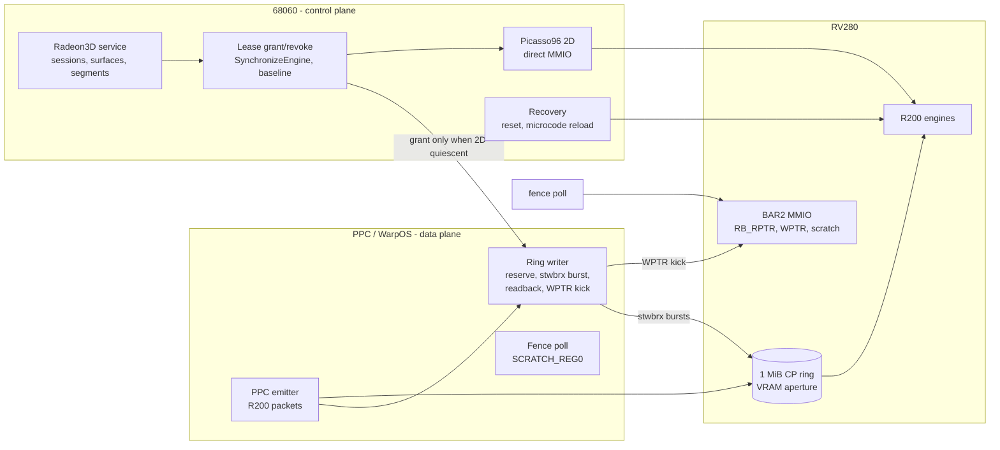
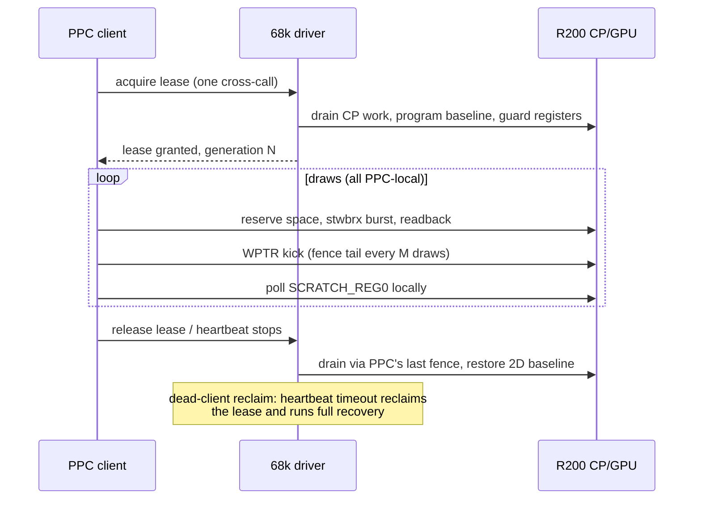

# 09 - PPC direct-ring design (Phase 0 proposal)

Status: **proposal, not implemented.** This document records the analysis for
moving the 3D data plane entirely to the PPC (WarpOS) side, with the 68k driver
remaining only as a control plane. Nothing in the current driver implements
this yet; the Phase-0 probe (see section 7) is the first executable step.

## 1. Motivation

The user-visible goal: 3D graphics should run on the PPC; the 68k should not
be on the per-draw path at all. The best possible shape is **direct CP-ring
access from the PPC**, with the 68k reduced to a control plane.

What already runs on the PPC today (interface 18, physical):

- Packet generation: the PPC CP-emitter builds complete R200 packet streams
  into streaming segments (600-frame gears run: 2,031 indirect submissions,
  511,620 CP dwords, 68.337 FPS windowed 800x600x32).
- **Radeon VRAM access from PPC is proven**: the MiniGL WarpOS VRAM probe
  (`minigl_ppc/examples/minigl_warpos_vram_probe.c`) leases a Radeon3D
  streaming segment - which is driver-private VRAM inside the BAR0 aperture -
  and the PPC stores to and loads from `segment.CpuAddress`, with the 68k
  verifying the result. PPC-side barriers (`eieio`/`sync` store barrier, `dcbf`
  data-cache flush) already exist in
  `minigl_ppc/examples/minigl_warpos_pci_barrier.s` and
  `minigl_warpos_cache_flush.s`.

What still runs on the 68k per submission:

| Cost | Where | Measured |
|---|---|---|
| Cross-CPU transport hop (Exec message round trip) | `minigl_ppc/client/minigl_ppc_transport.c` | ~0.1-0.5 ms per submission (est.; 0.38-0.45 ms measured for a native 68k single submit) |
| `RadeonPrepare3D` drain/restore checks | `src/radeon_accel.c` | part of 4.9 ms/frame build+prepare (semantic path) |
| Ring reservation: `CP_RB_RPTR` MMIO polls | `src/radeon_cp.c:168` | 1.45 us per MMIO read |
| 3-dword IB kick + 6-dword fence tail + guards (`CP_CSQ_MODE`, `DP_DATATYPE`) | `src/radeon3d_service.c:2045-2085` | ~16 ring dwords + 5 MMIO ops ≈ 15 us |
| Fence test (`SCRATCH_REG0` read + HDP read-buffer invalidate) | `src/radeon_cp.c:929` | ~3 MMIO accesses + cross-CPU hop |

Ring bandwidth is **not** the bottleneck (ring traffic is ~1.4 KB/frame, and
the 68k aperture already sustains 6.1-6.3 MB/s). The costs that matter are the
per-submission cross-CPU round trip and the 68k-side arbitration and fence
logic.

## 2. What "direct ring access from PPC" requires

The ring protocol is host-agnostic: it is memory plus two registers. A PPC
producer must replicate `CpCommitStream()` (`src/radeon_cp.c:310`):

1. Read `CP_RB_RPTR` (`0x0710`, BAR2 MMIO) for space - or point
   `CP_RB_RPTR_ADDR` (`0x070c`) at a VRAM dword so RPTR can be read through the
   BAR0 aperture without MMIO (register exists; the driver programs it to 0;
   verify RV280 support - it is the classic r100/r200 mechanism).
2. Write ring dwords through BAR0 (VRAM aperture). PPC is big-endian and the
   ring wants little-endian; `stwbrx` (store word byte-reversed) performs the
   swap for free - the PPC equivalent of the `rol/swap/movem` kernel in
   `CpBurstCopySwapped()`.
3. Read back the final dword before publishing (posted-write ordering; the
   invariant the driver has always enforced before `WPTR`).
4. Write `CP_RB_WPTR` (`0x0714`, BAR2) + readback.
5. Poll `SCRATCH_REG0` (`0x15e0`, BAR2) for fences, then do the
   `HOST_PATH_CNTL` HDP read-buffer invalidate; alternatively investigate
   `SCRATCH_ADDR`/`SCRATCH_UMSK` (`0x0774`/`0x0770`) to back the scratch in
   VRAM so fence polling needs no MMIO at all.

Minimum hardware requirement: a cache-inhibited PPC-side view of BAR0 and
BAR2. The bus addresses are already obtainable exactly the way
`Prometheus.card` obtains them (`Prm_GetBoardAttrsTags` with
`PRM_MemoryAddr0 + 0` / `+2`, `Prometheus/PrometheusCard/card_radeon9200.c:70-76`),
and the proven 1:1 address aliasing between PPC and the 68k map (the VRAM
probe dereferences 68k-mapped addresses directly) means a PPC producer can
likely use `bi->MemoryBase`/`bi->MemoryIOBase` verbatim. **Whether the alias
also covers BAR2 MMIO, and what PPC-side posted writes cost, is exactly what
the Phase-0 probe answers.**

## 3. The hard part: two CPUs, one engine, no cache coherency

The 68k and PPC run genuinely in parallel (WarpOS tasks vs AmigaOS tasks),
with no cache coherency between them and no Exec semaphore usable from PPC.
Meanwhile the 68k 2D path rewrites the shared engine baseline
(`HOST_PATH_CNTL`, `RB3D_CNTL`, `DP_DATATYPE`, `CP_CSQ_MODE`) on every 2D/3D
transition, and the 2026-09-08 matrix proved a wrong `DP_DATATYPE` bit or a
starved CSQ partition corrupts or stalls in-flight CP fetches. The parked
interface-19 experiments produced three distinct failure modes (hard wedge,
corrupted rendering, silent submission stall) when the drain discipline was
loosened even slightly.

**Recommended design: an explicit engine lease granted by the 68k.**

- The 68k driver stays the *control plane*: BIOS init, modeset, cursor, 2D,
  session/surface/segment management, recovery.
- Per frame, the PPC acquires the engine once, performs all ring work
  (reserve, write, kick, fence poll), then releases.
- Lease grant on the 68k reuses the existing `SynchronizeEngine()` /
  `Need2DRestore` machinery: grant only when 2D is quiescent and the CP
  baseline is set; on revoke, drain (the PPC's own fence tails provide the
  retire proof) and restore the 2D baseline.
- The lease word lives in VRAM (both CPUs see it uncached through their
  apertures - no cross-CPU cache-coherency problem) or in PPC RAM mirrored
  into the 68k window, with a heartbeat/timeout so a dead PPC client can never
  hold the engine: the 68k reclaims the lease after ~1 s and runs the existing
  `RadeonRecoverAcceleration()`.

This keeps all locking decisions on the 68k (two cross-calls per frame) while
the per-draw hot path becomes pure PPC.

## 4. Design options

| Option | Description | 68k work per draw | Verdict |
|---|---|---|---|
| A. Status quo + transport batching | Multiple IBs and a deferred fence per transport message | ~3 ring dwords + drain per frame | Cheap, small win; partially proven |
| B. Doorbell daemon | PPC writes IBs; a 68k high-priority daemon polls a shared doorbell and kicks | kick only, but latency plus a busy 68k loop | Muddy; not recommended |
| **C. PPC direct ring with engine lease** | PPC owns ring writes and fence polls inside a 68k-granted lease | ~2 cross-calls per frame, zero per draw | **Recommended** |
| D. Full PPC-side Radeon driver | PPC does init, modeset, everything | none | Far too large; 68k still needed for BIOS/desktop |

## 5. Expected savings

All "today" figures are measured on the reference machine with the recorded
artifacts (see [`04-performance.md`](04-performance.md)); all "projected"
figures are estimates that the Phase-0 probe is expected to replace with
measurements. The single largest unknown is PPC-side aperture/MMIO write
bandwidth, which sets the real ceiling for scenario 2.

| Scenario | Today (measured) | Projected with option C | Basis |
|---|---|---|---|
| Batched gears-class frame (3-4 submissions/frame), windowed 800x600x32 | 68.337 FPS (14.63 ms/frame) | ~72-78 FPS (**+5-15%**) | removes 3-4 transport hops plus service submit (~0.4-1.2 ms each, est.) and fence-test hops; lease adds ~0.2-0.6 ms once per frame |
| Fence test/wait latency | ~0.1-0.5 ms cross-CPU per wait (est.) | ~2-10 us PPC-local | MMIO read ~1.45 us on 68k; PPC MMIO cost pending Phase 0 |
| Draw-bound GL (Quake demo1 class, ~31+ Execute/frame, tiny batches) | 2.861-2.985 FPS; ~3.2 ms per Execute in the interface-9/streaming era | bounded by PPC ring cost + GPU/present, est. **8-12 FPS (3-4x)** | per-submit service cost collapses from ms to PPC-local tens of us; the ~12 FPS Warp3D Voodoo reference becomes the realistic bar |
| Ring / vertex stream bandwidth (68k-written data) | 6.1-6.3 MB/s aperture store; ~5.3 MB/s byte-swapped | PPC `stwbrx` bursts: pending Phase 0 (if >= 20-30 MB/s, large vertex streams and texture-data stops paying 68k bandwidth) | 68k floor measured flat 8 KiB-1 MiB |
| Texture uploads | PPC already writes texels directly into VRAM | unchanged | already PPC-side |
| 2D desktop, present, cursor | unchanged (68k) | unchanged | out of scope by design |

Reading of the numbers:

1. For the *current* MiniGL stack (already batched to ~3.4 indirect
   submissions per frame), the direct path is an increment, not a
   transformation: the ring traffic is tiny and the remaining 68k cost is a
   handful of cross-CPU hops per frame.
2. For *draw-bound* workloads - many small submissions, which is exactly the
   Quake shape that motivated the streaming work - the per-submit 68k cost is
   the whole bottleneck, and moving the ring writer to PPC is the only design
   that removes it entirely. This is where a 3-4x is plausible and where the
   "beat the Voodoo 12 FPS" goal lives.
3. Every projected number above that depends on PPC-side MMIO/aperture
   performance is marked pending Phase 0; if the probe measures PPC posted
   writes at or below the 68k's 6.1 MB/s, option C still wins on round-trip
   elimination but the bandwidth-bound scenarios shrink accordingly.

## 6. ABI and maintenance impact

- New capability bit (suggested `RADEON3D_CAP_PPC_RING`, bit 30, interface
  20) plus a control-block/lease query or call pair
  (`Radeon3DAcquireLease`/`Radeon3DReleaseLease` or equivalent private bridge
  query, following the existing `MGL_R200_PRIVATE_*` pattern).
- LVO append only; regenerate `proto/`/`inline/`/`clib/` headers for GCC and
  vbcc, run `make abi-check`, and reconcile the vendored MiniGL header in the
  same commit.
- Per the documentation rule, `docs/02-service-abi-reference.md` and
  `docs/01-ppc-client-guide.md` change together with the ABI.
- Two recovery owners is not acceptable: all CP resets and microcode reloads
  stay on the 68k. The PPC must never write reset registers.

## 7. Phase 0 - the decisive probe

Implemented as `tools/phase0/` in this repository (two binaries):

- `phase0host` (68k, `make phase0`): opens the chip by resident name, opens an
  interface-19 session, requires `CP_READY` + `STREAM_SEGMENTS`, proves the CP
  with a fenced PACKET2 batch, leases one 64 KiB control-block segment and one
  256 KiB arena segment, locates the board via `prometheus.library`
  (`PRM_MemoryAddr0` BAR0/BAR2 and sizes), measures the 68k baseline (MMIO
  read/write/write+readback, aperture store with final readback), publishes
  the control block (BAR pointers, arena pointer, 68k baseline numbers,
  safety flags), then waits for the PPC acknowledgement and prints the joint
  summary.
- `ppcphase0 <controlAddress>` (WarpOS PPC, `vc +warpos`): validates the
  control block, then measures on the PPC:
  1. MMIO read cost (`RBBM_STATUS`, `CP_RB_RPTR`, `SCRATCH_REG0`) - always
     safe.
  2. MMIO write cost, posted and write+readback committed, against
     `SCRATCH_REG1` (unused by the deployed driver's fence path). Skippable
     with `--no-mmio-write`.
  3. Aperture store bandwidth over the arena: native big-endian stores and
     `stwbrx` byte-reversed stores, with `eieio`/`sync` barriers at burst
     boundaries.
  4. Aperture read cost.
  5. `stwbrx` byte-order verification (the control-block handshake dword,
     verified by the 68k, doubles as the cross-CPU ordering proof).
  6. Writes its results into the control block and publishes `P0_PPC_ACK`.

Safety rules for the probe (both sides enforce what they can):

- Run only on the validated machine, with the matched pair installed and
  `CP=YES` active, and **no 3D client rendering** (the desktop may run).
- The PPC never writes MMIO except `SCRATCH_REG1`, and only after the control
  block advertises a quiescent CP (the host proves the CP by retiring a fenced
  batch before publishing).
- A failed or crashed PPC probe leaves the driver untouched: the host
  reclaims the segments and prints the failure; the 68k-side recovery paths
  are unchanged. A hard hang still requires the operator cold power cycle
  ([`08-troubleshooting.md`](08-troubleshooting.md#10-hard-hang-grey-screen-guru)).

Acceptance criteria for Phase 0 (what "go" looks like):

- PPC can read and write BAR2 MMIO through the aliased address map (scratch
  write + readback round-trips).
- PPC aperture write bandwidth measured (KB/s) for native and `stwbrx` stores,
  compared against the 68k baseline measured in the same boot.
- Committed (write+readback) MMIO cost measured on both CPUs.
- Cross-CPU ordering proven: the PPC's published results are read correctly by
  the 68k after the ack.

If the probe shows PPC cannot reach BAR2, option C is dead and option A
(batched transport) is the ceiling. If PPC aperture writes are materially
faster than 6.1 MB/s, the bandwidth-bound scenarios in section 5 improve
proportionally.

## 8. Open questions

1. Does the Sonnet/WarpOS PPC alias the full Amiga address map (including
   BAR2) cache-inhibited, or only selected windows? (Phase 0 answers the
   practical part; `sonnetlib` is the reference for the mapping.)
2. Does `CP_RB_RPTR_ADDR` in a VRAM scratch work on RV280 as the classic
   drivers use it? (Removes one MMIO read per submission from the PPC path.)
3. Does `SCRATCH_ADDR`/`SCRATCH_UMSK` scratch exchange work on RV280, letting
   the PPC poll fences through BAR0 only?
4. What PPC write bandwidth does the aperture actually sustain (posted, with
   barrier cadence)? This number decides how much of section 5 holds.
5. Lease granularity: per frame (recommended v1) or time-sliced with
   preemption points for desktop responsiveness?

## 9. Relationship to earlier experiments

- The preserved `phase2-cp-stream` branch (interface 17, PPC-side emission with
  68k submission) is the direct ancestor: it proved the PPC emitter, but kept
  the per-submission 68k cost that option C removes.
- The parked interface-19 fence coalescing (`d758199`) loosened the same drain
  discipline this design must keep; its three hardware failures are the
  calibration for how carefully the lease grant/revoke must be implemented.
- The VRAM probe's lease/confirm/end pattern is the template for the Phase-0
  control-block handshake.
