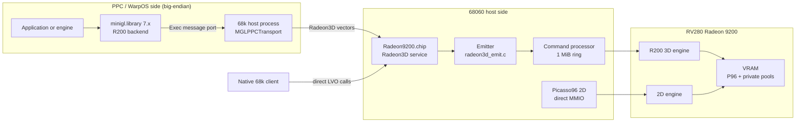
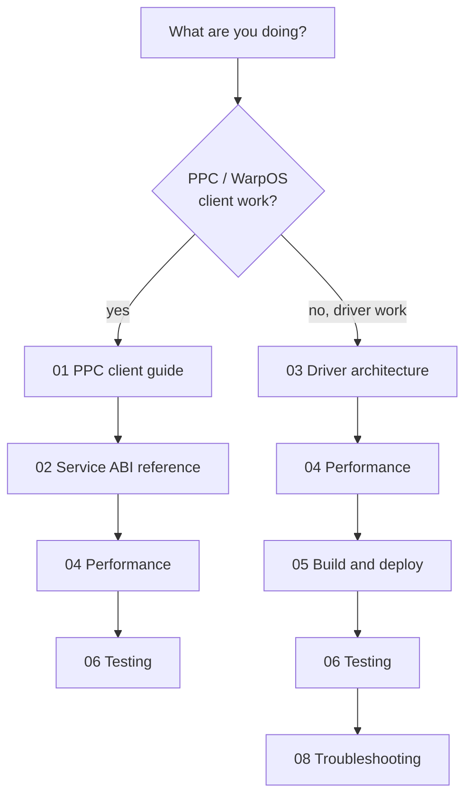

# Radeon9200 documentation

This directory is the reference documentation for the matched
`Radeon9200.chip` / `Prometheus.card` driver pair and for the Radeon3D service
that PPC (WarpOS) and 68k clients use to render through an RV280 Radeon 9200 on
a Prometheus/FireBird PCI bridge.

The documentation is written **PPC-consumer-first**: if you are writing or
porting a PPC/WarpOS application, engine or middleware layer that wants to use
this card, start with [`01-ppc-client-guide.md`](01-ppc-client-guide.md) and
[`02-service-abi-reference.md`](02-service-abi-reference.md). Driver-internal
material (68k code, locks, command processor, Picasso96 callbacks) follows in
[`03-driver-architecture.md`](03-driver-architecture.md).

## Current identity snapshot

Read from the source tree at the time this documentation was written; always
re-check `include/radeon3d.h` and `src/library.c` before quoting numbers.

| Item | Value |
|---|---|
| Library resident name | `Radeon9200.chip` (opened by name, not by path) |
| Disk path for Picasso96 | `LIBS:Picasso96/Radeon9200.chip` |
| Library version / revision | 3 / 0 (`$VER: Radeon9200.chip 3.0`) |
| Radeon3D interface version | 19 (`RADEON3D_IFACE_VERSION`) |
| Capability bits defined | 30 (`RADEON3D_CAP_*`, bits 0-29) |
| Matched card | `Prometheus.card` (Prometheus/PrometheusCard sources) |
| Supported PCI IDs | ATI `1002:5960`, `1002:5961`, `1002:5964` (RV280) |
| Reference CPU | 68060 @ 50 MHz, big-endian, FPU present |
| Reference GPU | RV280, 128 MiB VRAM board, 64 MiB linear aperture |
| EClock on the reference machine | 709,379 Hz (1 tick = 1.410 us = 70.5 CPU cycles) |
| CP ring | 1 MiB private VRAM, 256 Ki dwords, 16-byte aligned writes |
| Max batch | 8192 dwords (`RADEON3D_MAX_BATCH_DWORDS`) |
| Streaming segments | 12 x 256 KiB private VRAM (interface 13+) |
| Aux render surfaces | 4 MiB private pool, 8 surfaces (interface 17+) |
| Tested with | MiniGL (`minigl.library` 7.x) on WarpOS, native 68k probes |

The interface number in this tree (19) is newer than the vendored copy in the
MiniGL tree (`/home/mirek/minigl_ppc/third_party/radeon3d/include/radeon3d.h`,
interface 17). A consumer built against 17 keeps working: it simply never
receives the 18/19 capabilities. Any ABI change must be reconciled with that
vendored header before it is committed. See
[`02-service-abi-reference.md`](02-service-abi-reference.md#3-version-negotiation).

## Reading order

PPC/WarpOS client developers:

1. [`01-ppc-client-guide.md`](01-ppc-client-guide.md) - how a PPC consumer
   reaches a 68k driver, memory/endianness/cache rules, session lifecycle, the
   three submission paths, fences, and a worked integration sequence.
2. [`02-service-abi-reference.md`](02-service-abi-reference.md) - every LVO,
   structure, record layout, validation rule, error encoding and limit.
3. [`04-performance.md`](04-performance.md) - what a call costs in
   microseconds/cycles, how to batch, and where the measured ceilings are.
4. [`06-testing.md`](06-testing.md) - probes you can run before trusting a
   change.

Driver developers (68k):

1. [`03-driver-architecture.md`](03-driver-architecture.md) - source map,
   initialization, service state machine, locks, CP, 2D engine, display, BIOS,
   cursor, private VRAM and telemetry.
2. [`04-performance.md`](04-performance.md) - measured attribution and the
   rules for producing publishable numbers.
3. [`05-build-deploy-run.md`](05-build-deploy-run.md) - build matrix,
   ToolTypes, installation, recovery layers.
4. [`06-testing.md`](06-testing.md) and
   [`07-history.md`](07-history.md) - acceptance suites and why the current
   design looks the way it does.
5. [`08-troubleshooting.md`](08-troubleshooting.md) - stage codes, recovery,
   bring-up hazards.

## Document map

| File | Contents |
|---|---|
| [`01-ppc-client-guide.md`](01-ppc-client-guide.md) | PPC/WarpOS integration guide, cross-CPU rules, submission patterns, worked sequence |
| [`02-service-abi-reference.md`](02-service-abi-reference.md) | Radeon3D ABI: LVOs, capabilities, info block, surfaces, records, commits, indirect dispatch, fences |
| [`03-driver-architecture.md`](03-driver-architecture.md) | 68k driver internals: library, init, locks, CP, 2D, display, BIOS, cursor, DMA, telemetry |
| [`04-performance.md`](04-performance.md) | Reference machine, cycle conversions, all measured figures, methodology |
| [`05-build-deploy-run.md`](05-build-deploy-run.md) | Build targets/flags, ToolTypes, installation, automatic and manual recovery |
| [`06-testing.md`](06-testing.md) | Test/probe inventory, acceptance procedures, metadata requirements |
| [`07-history.md`](07-history.md) | Condensed chronological log, artifact identities, rejected and parked work |
| [`08-troubleshooting.md`](08-troubleshooting.md) | Failure stages, error encodings, recovery recipes, hardware hazards |

## Documentation maintenance rule

**Every change that is committed and pushed to the remote must update this
documentation in the same commit (or in a follow-up commit pushed immediately
afterwards).** This is a hard rule, recorded in
[`../Agents.md`](../Agents.md). At minimum:

- If the ABI, capability bits, limits, or interface version change:
  [`02-service-abi-reference.md`](02-service-abi-reference.md) and
  [`01-ppc-client-guide.md`](01-ppc-client-guide.md).
- If performance-relevant code changes: add the new measured figures, and mark
  superseded figures as historical, in
  [`04-performance.md`](04-performance.md).
- If build flags, ToolTypes, install paths or recovery change:
  [`05-build-deploy-run.md`](05-build-deploy-run.md).
- If tests, probes or their output formats change:
  [`06-testing.md`](06-testing.md).
- Every release or physical-validation run: append a dated entry to
  [`07-history.md`](07-history.md) with artifact identities.

Numbers in this documentation are only valid with the metadata that produced
them (artifact CRC/SHA-256, cold/warm boot, ToolTypes, mode). Never restate an
old number as a current result; move it to a clearly labelled historical table.

## Conventions used in these documents

- Diagrams are [Mermaid](https://mermaid.js.org/) blocks; they render directly
  on GitHub and in any Mermaid-capable Markdown viewer. When a flow, state
  machine or layout changes, update the matching diagram in the same commit.
- "Host CPU" means the 68k CPU (the 68060) that runs AmigaOS and this driver.
  "PPC" means the WarpOS CPU (e.g. MPC7410 on the reference machine).
- Register and packet dwords are described as seen by the host CPU unless the
  text explicitly says "CP-native" (byte-swapped for the little-endian Radeon
  register bus). All public `Radeon3D` structures and records are big-endian
  host-endian; both 68k and PPC are big-endian, so no conversion is needed
  between them.
- Cycle figures assume the reference 68060 at 50 MHz (20 ns/cycle). EClock
  ticks convert as `us = ticks * 1e6 / 709379`. Treat them as order-of-
  magnitude costs for hot paths, not exact instruction timings.
- "RV280" is used interchangeably with "Radeon 9200" and "R200-class engine".
- LVO offsets are negative offsets from the library base in `A6`, as usual for
  Amiga shared libraries.
